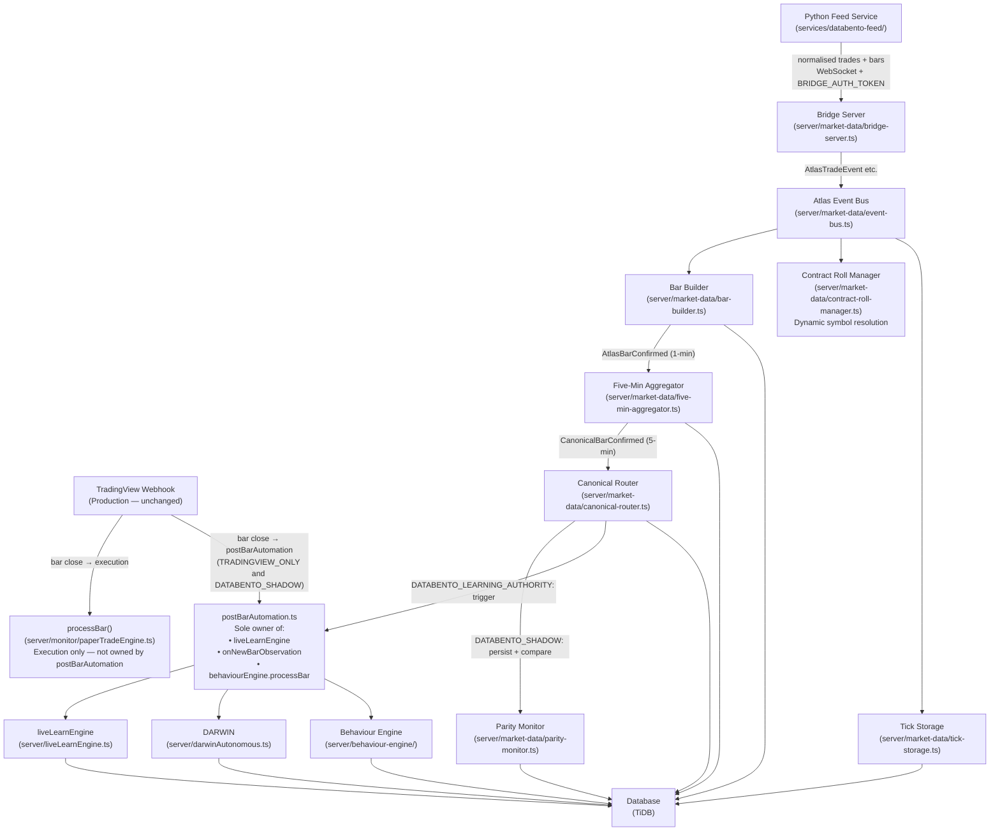
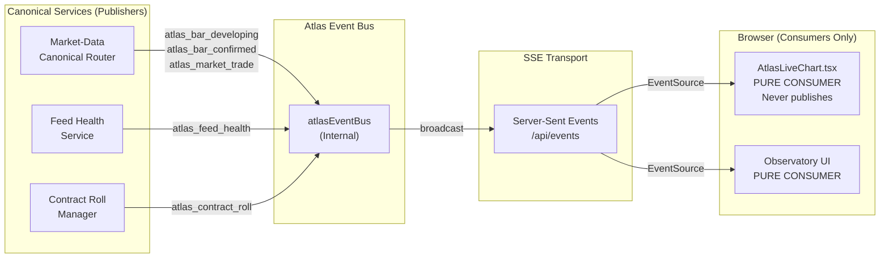
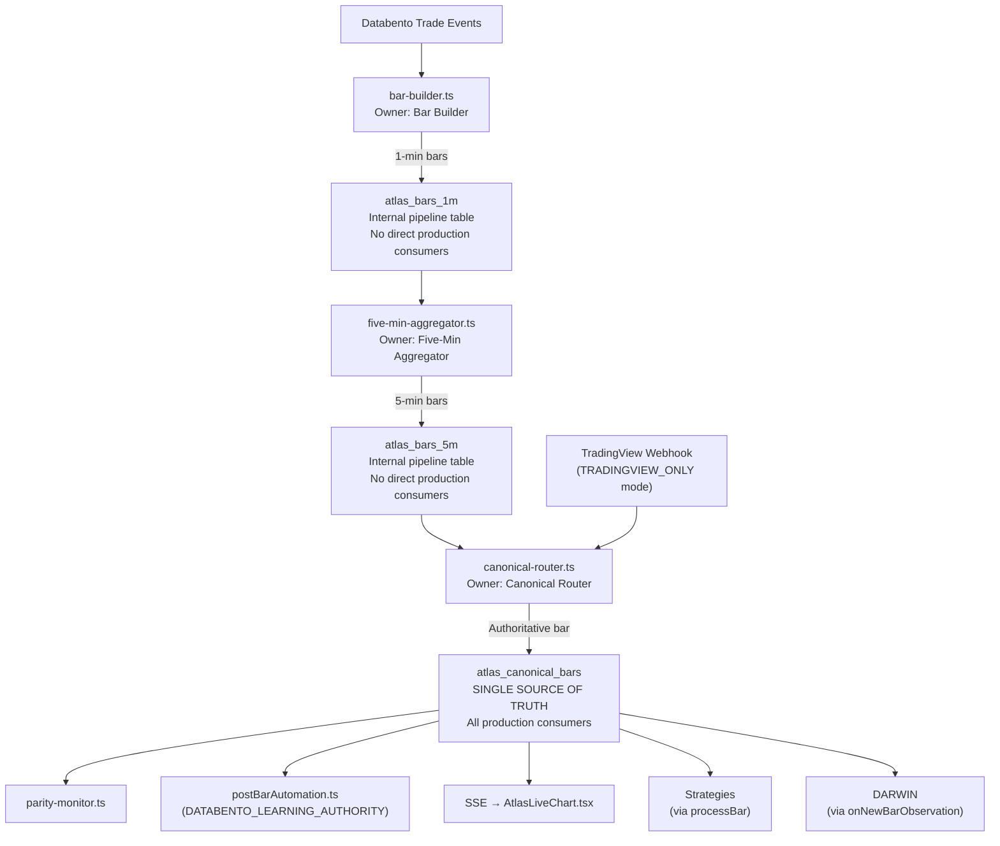
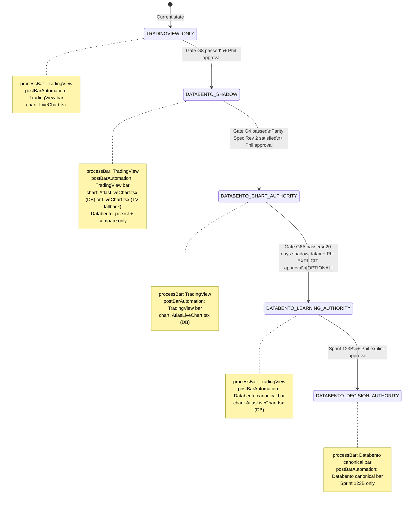

# Sprint 123A Dependency Diagram (Revision 2)
**Document type:** Architecture Reference  
**Sprint:** 123A  
**Status:** PENDING APPROVAL  
**Date:** 2026-07-18 (Revision 2: Corrections 2, 3, 4, 5 applied — chart event direction, gate split, G7 independence, MNQ1! removed)  
**Parent document:** `SPRINT_123A_AMENDED_IMPLEMENTATION_PLAN.md`

---

## Sub-Sprint Dependency Graph

Gate G6A is optional. Sprint 123A is complete at Gate G7 regardless of whether G6A is passed.

```mermaid
graph TD
    G0["Gate G0\nPlan Approval\n(Phil)\nPENDING"]
    S1["Sprint 123A.1\nFoundation\n• Feature flags\n• DB schema (7 tables)\n• Canonical event types\n• postBarAutomation\n• G-001 fix: onNewBarObservation\n• G-002 fix: monthly review\n• Architecture docs"]
    G1["Gate G1\n123A.1 Complete\n(Phil)"]
    INT001["TEST-INT-001\nDatabento Symbol Resolution\nOpt-in integration test\nMust pass before 123A.2"]
    S2["Sprint 123A.2\nDatabento Adapter\n• Python feed service\n• Bridge server\n• trades normaliser\n• Secret scanning tests"]
    G2["Gate G2\n123A.2 Complete\n(Phil)"]
    S3["Sprint 123A.3\nCanonical Bars\n• Bar builder (1-min)\n• 5-min aggregator\n• Contract roll manager\n• Canonical router\n• Tick storage\n• Effective-once ledger"]
    G3["Gate G3\n123A.3 Complete\n(Phil)"]
    S4["Sprint 123A.4\nParity + Chart\n• Parity monitor\n• AtlasLiveChart.tsx\n• Trade lifecycle SSE\n• Chart authority gate"]
    G4["Gate G4\nParity Certification\n(per Parity Spec Rev 2)\n(Phil)"]
    G5["Gate G5\n123A.4 Complete\n(Phil)"]
    S5["Sprint 123A.5\nLearning Authority\nImplementation\n• postBarAutomation update\n• Canonical BE trigger\n• DARWIN canonical trigger\n• Duplicate protection"]
    G6["Gate G6\n123A.5 Implementation\nCertified\nLearning Auth DISABLED\n(Phil)"]
    G6A["Gate G6A\nOptional\nLearning Authority\nActivation\n(Phil explicit)"]
    G7["Gate G7\n123A Complete\n(Phil)\n123A complete with or\nwithout G6A"]
    S123B["Sprint 123B\nDecision Authority\n(Separate approval)"]

    G0 --> S1
    S1 --> G1
    G1 --> INT001
    INT001 --> S2
    S2 --> G2
    G2 --> S3
    S3 --> G3
    G3 --> S4
    S4 --> G4
    G4 --> G5
    G5 --> S5
    S5 --> G6
    G6 --> G7
    G6 --> G6A
    G6A -.->|"Optional path\nnot required for G7"| G7
    G7 --> S123B

    style G0 fill:#f0ad4e,color:#000
    style G1 fill:#f0ad4e,color:#000
    style G2 fill:#f0ad4e,color:#000
    style G3 fill:#f0ad4e,color:#000
    style G4 fill:#d9534f,color:#fff
    style G5 fill:#f0ad4e,color:#000
    style G6 fill:#f0ad4e,color:#000
    style G6A fill:#5cb85c,color:#fff
    style G7 fill:#f0ad4e,color:#000
    style INT001 fill:#9b59b6,color:#fff
    style S1 fill:#5bc0de,color:#000
    style S2 fill:#5bc0de,color:#000
    style S3 fill:#5bc0de,color:#000
    style S4 fill:#5bc0de,color:#000
    style S5 fill:#5bc0de,color:#000
    style S123B fill:#999,color:#fff
```



---

## Component Dependency Graph (Corrected — Correction 1: postBarAutomation ownership)

The direct TradingView → `liveLearnEngine` arrow is removed. `postBarAutomation` is the sole caller of `liveLearnEngine`, `onNewBarObservation`, and `behaviourEngine.processBar`.



---

## Event Flow Diagram (Corrected — Correction 2: chart is pure consumer)

`AtlasLiveChart.tsx` is a pure SSE consumer. It never publishes to the Atlas Event Bus.



---

## Bar Table Ownership (Correction 8)

Three bar tables exist. Each has a single owner. No production consumer reads from `atlas_bars_1m` or `atlas_bars_5m` directly.



---

## Authority Mode Transition (Correction 3: G6A is optional)



---

## Symbology Note (Correction 5)

No diagram in this document hardcodes any Databento continuous symbol. The actual symbol for MNQ front-month is resolved dynamically by the Contract Roll Manager from the Databento metadata API. `TEST-INT-001` must pass before Sprint 123A.2 begins to confirm the actual symbol name. The confirmed symbol is recorded in `docs/evidence/TEST-INT-001-result.md`.

---

## Rollback Path (Correction 9)

Any sub-sprint can be rolled back by setting `MARKET_DATA_AUTHORITY=TRADINGVIEW_ONLY`. All new tables are preserved. Table removal is only permitted for an explicitly approved destructive development reset.

```
ROLLBACK PROCEDURE:
1. Set MARKET_DATA_AUTHORITY=TRADINGVIEW_ONLY
2. Set DATABENTO_LIVE_ENABLED=false
3. Stop Python service and bridge server
4. Verify: TradingView webhook processes bars normally
5. Verify: processBar() called from nexusRoutes.ts (execution path)
6. Verify: postBarAutomation called from TradingView bar
7. DO NOT drop any tables — they contain validation evidence
8. Table removal: only with Phil's explicit written approval for a destructive development reset
```
