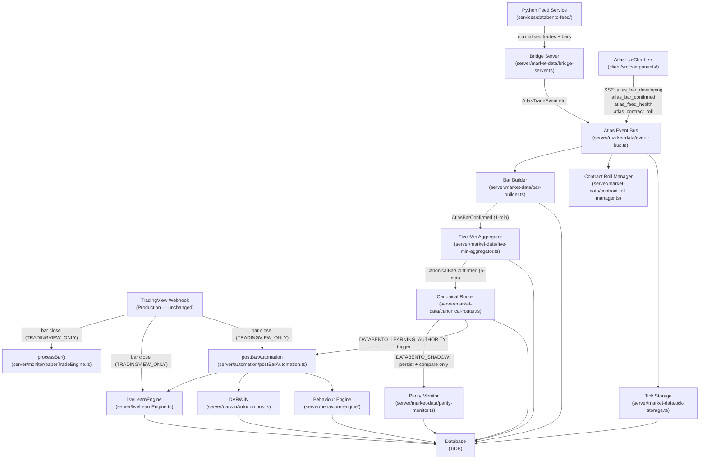
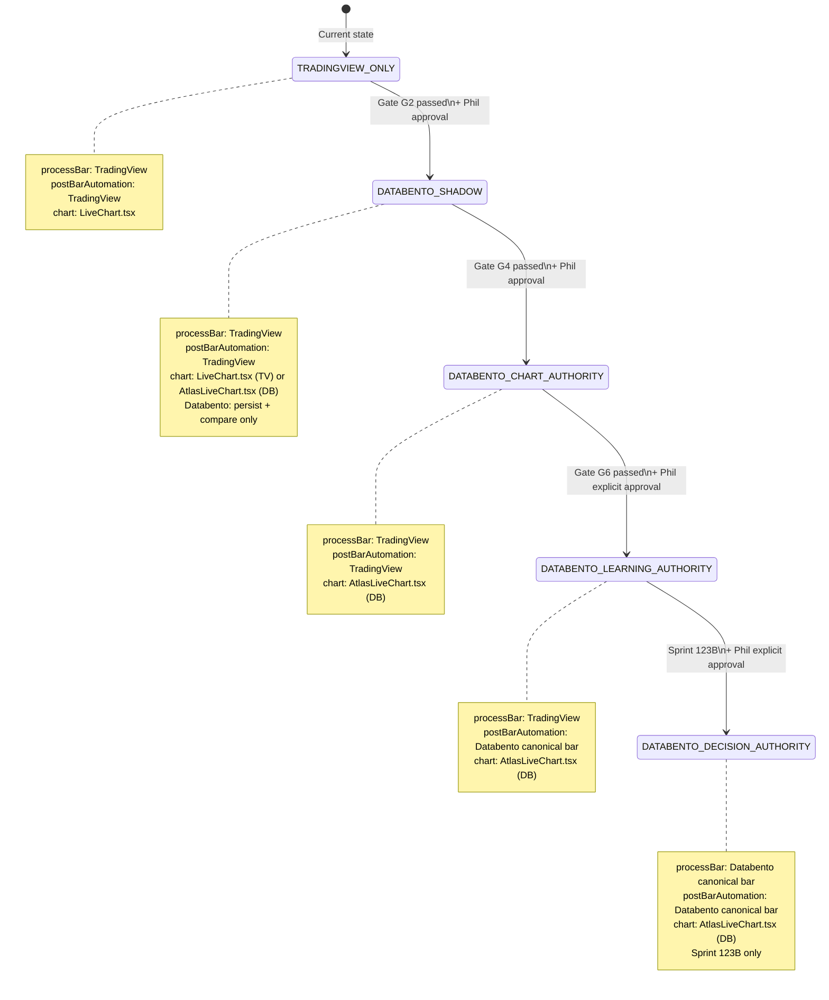

# Sprint 123A Dependency Diagram
**Document type:** Architecture Reference  
**Sprint:** 123A  
**Status:** PENDING APPROVAL  
**Date:** 2026-07-18

---

## Sub-Sprint Dependency Graph

```mermaid
graph TD
    G0["Gate G0\nPlan Approval\n(Phil)"]
    S1["Sprint 123A.1\nFoundation\n• Feature flags\n• DB schema\n• Canonical event types\n• postBarAutomation\n• G-001 fix\n• G-002 fix\n• Architecture docs"]
    G1["Gate G1\n123A.1 Complete\n(Phil)"]
    S2["Sprint 123A.2\nDatabento Adapter\n• Python feed service\n• Bridge server\n• trades normaliser\n• Secret scanning"]
    G2["Gate G2\n123A.2 Complete\n(Phil)"]
    S3["Sprint 123A.3\nCanonical Bars\n• Bar builder (1-min)\n• 5-min aggregator\n• Contract roll manager\n• Canonical router\n• Tick storage\n• Effective-once ledger"]
    G3["Gate G3\n123A.3 Complete\n(Phil)"]
    S4["Sprint 123A.4\nParity + Chart\n• Parity monitor\n• AtlasLiveChart.tsx\n• Trade lifecycle SSE\n• Chart authority gate"]
    G4["Gate G4\nParity Certification\n≥99.9% over 5 days\n(Phil)"]
    G5["Gate G5\n123A.4 Complete\n(Phil)"]
    S5["Sprint 123A.5\nLearning Authority\n• postBarAutomation update\n• Canonical BE trigger\n• DARWIN canonical trigger\n• Duplicate protection"]
    G6["Gate G6\nLearning Authority\nActivation\n(Phil explicit)"]
    G7["Gate G7\n123A Complete\n(Phil)"]
    S123B["Sprint 123B\nDecision Authority\n(Separate approval)"]

    G0 --> S1
    S1 --> G1
    G1 --> S2
    S2 --> G2
    G2 --> S3
    S3 --> G3
    G3 --> S4
    S4 --> G4
    G4 --> G5
    G5 --> S5
    S5 --> G6
    G6 --> G7
    G7 --> S123B

    style G0 fill:#f0ad4e,color:#000
    style G1 fill:#f0ad4e,color:#000
    style G2 fill:#f0ad4e,color:#000
    style G3 fill:#f0ad4e,color:#000
    style G4 fill:#d9534f,color:#fff
    style G5 fill:#f0ad4e,color:#000
    style G6 fill:#d9534f,color:#fff
    style G7 fill:#f0ad4e,color:#000
    style S1 fill:#5bc0de,color:#000
    style S2 fill:#5bc0de,color:#000
    style S3 fill:#5bc0de,color:#000
    style S4 fill:#5bc0de,color:#000
    style S5 fill:#5bc0de,color:#000
    style S123B fill:#999,color:#fff
```

---

## Component Dependency Graph

---

## Authority Transition Diagram

