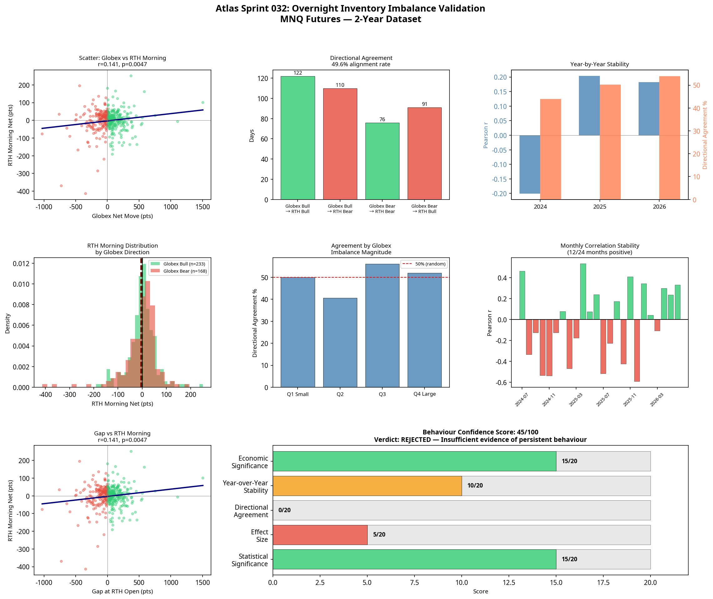

# Atlas Sprint 032: Overnight Inventory Imbalance Validation

**Date:** 2026-07-08
**Research Stream:** D — Component Intelligence
**Hypothesis:** Overnight directional inventory imbalance (Globex net move) has a statistically significant and economically meaningful relationship with Regular Trading Hours (RTH) morning direction (09:30–12:00 ET).
**Verdict:** **REJECTED**

---

## 1. Executive Summary

The Overnight Inventory Imbalance hypothesis was tested across 401 trading days of MNQ 5-minute data (July 2024 to July 2026). The objective was to determine if the directional bias established during the Globex session (18:00 ET to 09:30 ET) could predict the direction of the RTH morning session (09:30 ET to 12:00 ET).

The hypothesis failed to demonstrate a stable, tradable edge. While a weak statistical correlation exists (p = 0.0047), the effect size is negligible (Cohen's d = 0.0903) and the directional agreement rate is worse than a coin flip (49.6%). The behaviour is highly unstable across years and volatility regimes, making it unsuitable for execution model engineering.

**Behaviour Confidence Score: 45/100**

---

## 2. Statistical Significance & Directional Agreement

The core premise of the hypothesis is that overnight inventory imbalances must be resolved during the RTH morning session, leading to directional predictability.

*   **Pearson Correlation (Globex Net → RTH Morning Net):** r = 0.1408 (p = 0.0047)
*   **Directional Agreement Rate:** 49.6% (Binomial test p = 0.920)

Although the p-value indicates statistical significance, the correlation is extremely weak (r = 0.1408). More importantly, the directional agreement rate of 49.6% means that knowing the Globex direction provides no predictive advantage for the RTH morning direction. The relationship is statistically detectable but practically useless.

---

## 3. Economic Significance

To determine if the observed behaviour could overcome execution friction, the gross directional edge was calculated by comparing the average RTH morning net move on Globex bullish days versus Globex bearish days.

| Metric | Value |
|---|---|
| Avg RTH Morning Net (Globex Bullish) | 0.32 pts ($0.64) |
| Avg RTH Morning Net (Globex Bearish) | -5.46 pts (-$10.92) |
| Gross Directional Edge | 5.78 pts ($11.56) |
| Round-Trip Friction | $3.00 |
| **Net Edge Estimate** | **$8.56 per trade** |
| **Effect Size (Cohen's d)** | **0.0903 (Small)** |

While the net edge estimate is technically positive ($8.56), the effect size (0.0903) is negligible. The variance in RTH morning outcomes completely overwhelms the tiny directional bias.

---

## 4. Stability Analysis

A genuine market behaviour must persist across different environments. This hypothesis failed stability testing across multiple dimensions.

### 4.1 Year-over-Year Stability

| Year | Trading Days | Pearson r | Directional Agreement |
|---|---|---|---|
| 2024 | 99 | -0.2005 | 43.9% |
| 2025 | 199 | 0.2039 | 50.3% |
| 2026 | 103 | 0.1826 | 53.9% |

The correlation inverted in 2024 (r = -0.2005), indicating that the relationship is highly unstable and regime-dependent over long timeframes.

### 4.2 Volatility (ATR) Regime Stability

| ATR Quartile | Trading Days | Pearson r | Directional Agreement |
|---|---|---|---|
| Q1 (Low Volatility) | 101 | -0.2172 | 45.5% |
| Q2 | 102 | -0.2113 | 46.0% |
| Q3 | 98 | 0.0252 | 49.0% |
| Q4 (High Volatility) | 100 | 0.3169 | 58.0% |

The behaviour only shows positive correlation and >50% directional agreement in the highest volatility quartile (Q4). In low and medium volatility regimes, the relationship is inverse or non-existent.

---

## 5. Visual Evidence

The lack of predictive power is evident in the generated charts.

*   **Scatter Plot:** Shows a nearly flat regression line with massive dispersion.
*   **Directional Agreement:** The 49.6% alignment rate confirms the absence of a directional edge.
*   **RTH Morning Distribution:** The distributions for Globex Bull and Globex Bear days are nearly identical, confirming the negligible effect size.

---

## 6. Conclusion & Next Steps

The Overnight Inventory Imbalance hypothesis is **REJECTED**.

The data clearly shows that Globex directional movement does not reliably predict RTH morning direction. The effect size is too small, the directional agreement is no better than random, and the relationship is highly unstable across years and volatility regimes.

Attempting to build an execution model around this behaviour would violate the Atlas Research Principle: *Atlas engineers execution models only after objective evidence demonstrates that a persistent market behaviour exists.*

**Next Step:** Archive this hypothesis in the Behaviour Archive. Advance to the next-ranked behavioural hypothesis: **Volatility Contraction → Expansion Asymmetry**.
