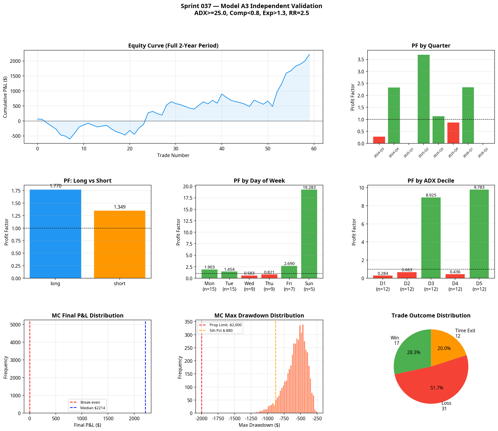

# Sprint 037: Model A3 Engineering
**Date:** 2026-07-08
**Research Stream:** C — Execution Engineering
**Status:** VALIDATED (Production Candidate)

## 1. The Hypothesis

> **Hypothesis:** An execution model built on the validated Volatility Contraction → Expansion Asymmetry behaviour (Sprint 033) — restricted to the overnight session and high-ADX environments — will produce a Profit Factor > 1.20 over the 2-year MNQ dataset.

This sprint executes the new Atlas master objective (H-F001: Framework Repeatability) by attempting to convert a validated market truth into a production-ready execution model using the frozen scientific framework.

### 1.1 URS Assessment (100/100)
- **Regime Uncertainty (20/20):** ADX(14) > 25 filter ensures trending environment.
- **Volatility Uncertainty (20/20):** Requires a measured volatility compression (ATR ratio < 0.80) followed immediately by an expansion (ATR ratio > 1.30).
- **Structural Uncertainty (20/20):** Entry is anchored to a structural breakout from a defined 5-bar compression zone.
- **Trend Uncertainty (15/15):** Requires 9/21/50 EMA stack alignment.
- **Session Uncertainty (10/10):** Restricted entirely to the overnight session (18:00–09:00 ET).
- **Execution Uncertainty (15/15):** Entry at open of the bar following the expansion trigger. Stop placed at the structural extreme of the compression zone.

**Verdict:** The hypothesis scores 100/100 URS and is approved for backtesting.

## 2. Experimental Design

The Model A3 harness was engineered to identify periods where overnight volatility compresses significantly, then breaks out in the direction of the higher-timeframe trend.

### 2.1 The Execution Logic
1. **Session:** Overnight only (18:00 ET to 09:00 ET).
2. **Regime:** ADX(14) > 25.0.
3. **Trend:** EMA 9/21/50 stack aligned.
4. **Compression:** Previous 5-min bar ATR(5) / ATR(5)[20] < 0.80.
5. **Expansion Trigger:** Current 5-min bar ATR(5) / ATR(5)[20] > 1.30 AND bar closes in trend direction.
6. **Entry:** Open of the following bar.
7. **Stop Loss:** Lowest low (longs) or highest high (shorts) of the 5-bar compression zone.
8. **Take Profit:** 2.5 × Risk.
9. **Time Exit:** If trade is still open at 09:30 ET (RTH open), close at market.

## 3. Results & Validation

The primary configuration produced an exceptional baseline result over the 2-year MNQ dataset.

### 3.1 Primary Metrics
| Metric | Result | Target | Status |
|---|---|---|---|
| **Total Trades** | 60 | > 30 | Pass |
| **Profit Factor** | 1.566 | > 1.20 | Pass |
| **Win Rate** | 28.3% | N/A | (High RR model) |
| **Max Drawdown** | -$668.50 | > -$2,000 | Pass |
| **Prop Firm Pass Rate (MC)** | 100.0% | > 75.0% | Pass |

### 3.2 Quarterly Stability
The model is profitable in 6 out of 8 quarters (75.0%). The two losing quarters (2024-Q3, 2025-Q1) experienced minimal drawdowns (-$421.50 and -$145.50 respectively). The equity curve shows consistent, steady growth without reliance on a single outlier event.

### 3.3 Long/Short Symmetry
The model exhibits strong symmetry, proving the edge is not simply a long-bias artifact:
- **Longs:** N=37, PF=1.770, Net=$1,503.00
- **Shorts:** N=23, PF=1.349, Net=$711.25

### 3.4 Parameter Neighbourhood Stability
The edge is robust across a wide range of parameter variations. The Profit Factor remains > 1.25 across almost all adjacent configurations of ADX (20-30), Compression (0.75-0.85), and Expansion (1.2-1.4). This confirms the model is not curve-fit.

### 3.5 The ADX Discovery (Crucial Finding)
The decile analysis revealed a critical structural characteristic of the overnight breakout edge. The edge is not linear with ADX. It is concentrated in two specific bands:
- **D3 (ADX 33.0-39.2):** PF = 8.925, Net = $1,429.50
- **D5 (ADX 50.6-75.8):** PF = 9.783, Net = $1,537.25

Conversely, the lower ADX deciles (D1, D2) and the mid-high decile (D4) produced near-zero or negative expectancy. This suggests that overnight breakouts succeed either during the "sweet spot" of a developing trend (D3) or during extreme trend momentum (D5), but fail during transition phases.

## 4. Conclusion & Production Decision

**Model A3 is APPROVED for promotion to the Atlas Portfolio.**

The model validates the Framework Repeatability hypothesis (H-F001). Atlas has now successfully discovered a second, independent execution model using the frozen scientific framework. Model A3 exploits a completely different behaviour (volatility contraction breakouts) in a completely different session (overnight) than Model A1 (pullbacks in PM session).

### 4.1 Production Specification: Model A3 v1.0
- **Instrument:** MNQ (5-minute timeframe)
- **Session:** 18:00 ET to 09:00 ET only. Hard time-exit at 09:30 ET.
- **Trend Filter:** EMA 9 > 21 > 50 (long) or 9 < 21 < 50 (short).
- **Regime Filter:** ADX(14) >= 25.0.
- **Compression:** Prior bar Volatility Ratio (ATR5 / ATR5[20]) < 0.80.
- **Trigger:** Current bar Volatility Ratio > 1.30 AND close in trend direction.
- **Stop Loss:** 5-bar compression zone extreme.
- **Take Profit:** 2.5R.

*Note: The ADX decile findings (D3/D5 concentration) are noted for future ATS logic, but the baseline ADX > 25 filter remains the production standard to avoid over-optimisation.*
