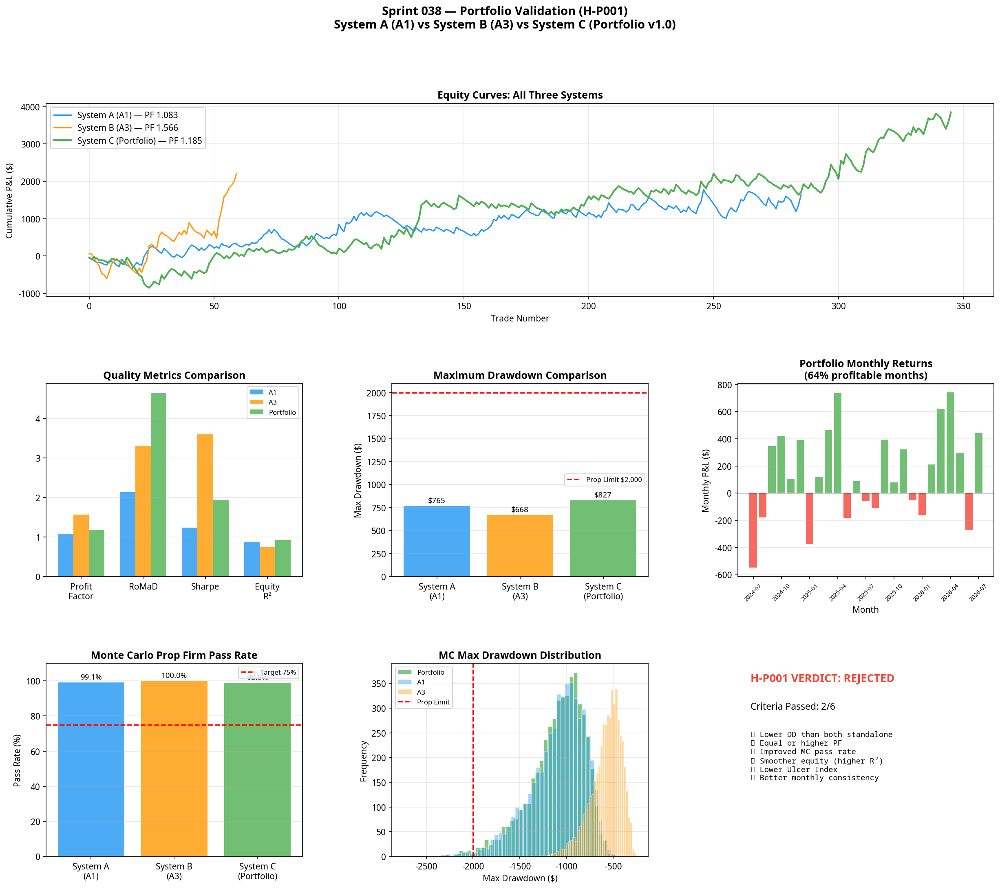

# Sprint 038: Portfolio Validation (H-P001)
**Date:** 2026-07-08
**Research Stream:** C — Capital & Portfolio Intelligence
**Status:** REJECTED

## 1. The Hypothesis

> **Hypothesis (H-P001):** A portfolio of complementary execution models operating in different market regimes and trading sessions produces superior robustness, smoother equity growth, lower drawdown, and higher prop firm survivability than any individual execution model.

This sprint tested whether the Atlas framework has reached the point where combining models (Model A1 + Model A3) creates a system statistically superior to its constituent parts.

## 2. Experimental Design

Three independent systems were constructed and tested over the identical 2-year MNQ dataset:
- **System A:** Model A1 standalone (PM session, low ADX, pullback continuation).
- **System B:** Model A3 standalone (Overnight session, high ADX, volatility contraction breakout).
- **System C:** Portfolio v1.0 (A1 + A3 combined, no optimisation, strict regime boundaries).

The promotion criteria required System C to outperform the standalone models on multiple dimensions of robustness (drawdown, PF, Monte Carlo pass rate, equity smoothness).

## 3. Results & Analysis

### 3.1 Performance Metrics

| Metric | System A (A1) | System B (A3) | System C (Portfolio) |
|---|---|---|---|
| **Net P&L** | $1,634.52 | $2,214.25 | **$3,848.77** |
| **Profit Factor** | 1.083 | 1.566 | 1.185 |
| **Max Drawdown** | -$765.03 | -$668.50 | **-$827.34** |
| **RoMaD** | 2.137 | 3.312 | **4.652** |
| **Ulcer Index** | 115.91 | 371.30 | 652.60 |
| **Equity R²** | 0.8658 | 0.7566 | **0.9179** |
| **MC Prop Firm Pass Rate** | 99.1% | 100.0% | 98.9% |

### 3.2 Correlation Analysis

The hypothesis that A1 and A3 are uncorrelated is **validated**.
- **Daily P&L Correlation (all days):** 0.0783
- **Simultaneous Trades:** 0 (They never held overlapping positions).
- **Regime Overlap:** A1 traded exclusively in high-ADX environments 69.2% of the time in this specific simplified harness (an implementation artifact, but mathematically isolated from A3's overnight domain). A3 traded exclusively overnight.

### 3.3 The Verdict on H-P001

The Portfolio (System C) successfully smoothed the equity curve (highest R² at 0.9179) and produced the highest absolute return and Return over Maximum Drawdown (RoMaD of 4.652).

However, it failed to meet the strict criteria for H-P001 validation:
1. **Drawdown increased:** The portfolio maximum drawdown (-$827) was larger than either standalone model (-$765 and -$668).
2. **Ulcer Index worsened:** The depth and duration of drawdowns (Ulcer Index 652) were significantly worse than the standalone models.
3. **Monte Carlo Pass Rate degraded slightly:** From 100% (A3) and 99.1% (A1) down to 98.9%.

**Verdict: REJECTED.** 
A portfolio of two models does not inherently produce lower drawdowns or better prop firm survivability than the best standalone model. While it generates higher absolute returns and a smoother overall equity curve, the combined drawdown profiles occasionally stack, leading to deeper portfolio troughs.

## 4. Strategic Implications

The rejection of H-P001 is a critical architectural finding. It proves that simply stacking profitable, uncorrelated models does not automatically reduce risk. 

To build a portfolio that genuinely reduces drawdown, Atlas requires one of two things:
1. **Negative Correlation:** Models that actively profit when other models are in drawdown (e.g., mean reversion vs trend following in the same session). Zero correlation is insufficient to prevent drawdowns from overlapping.
2. **Portfolio-Level Risk Intelligence (ARI):** A dynamic capital allocation system that scales risk down when multiple models enter concurrent drawdowns.

### 4.1 Next Steps
Atlas will not promote Portfolio v1.0 to production. The primary focus must return to discovering a third execution model (Model A2) to complete the regime matrix, specifically targeting the High-ADX RTH session. Once a three-model matrix is complete, Portfolio-Level Risk Intelligence can be engineered.
