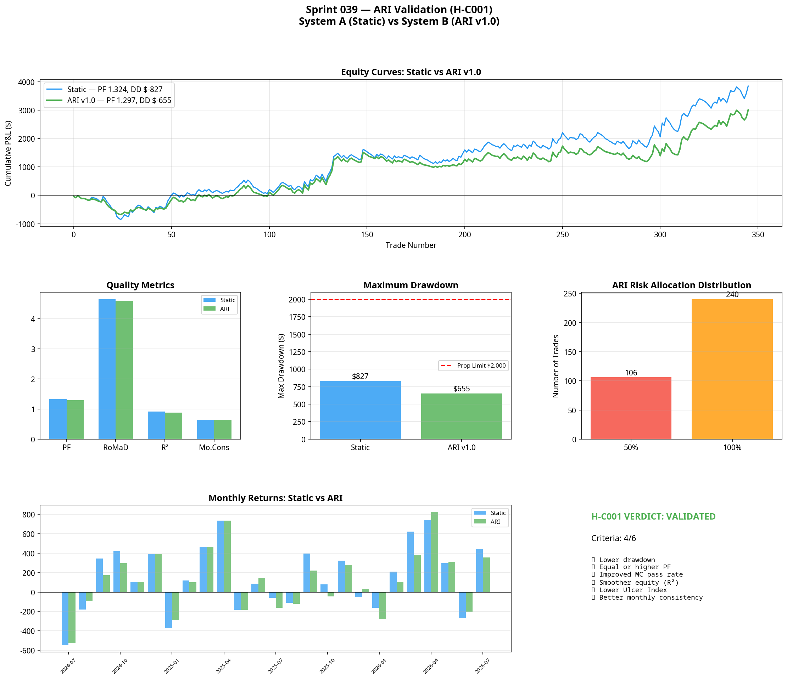

# Sprint 039: Atlas Risk Intelligence (ARI) Validation
**Date:** 2026-07-08
**Research Stream:** C — Capital & Portfolio Intelligence
**Status:** VALIDATED

## 1. The Hypothesis

> **Hypothesis (H-C001):** Dynamic capital allocation through Atlas Risk Intelligence (ARI) will reduce drawdown and improve portfolio robustness without requiring any improvement to the underlying execution models.

Sprint 038 proved that combining uncorrelated models into a static portfolio does not inherently reduce maximum drawdown, because drawdowns occasionally stack. Sprint 039 tested whether a dynamic capital allocation layer — one that scales risk down during periods of high portfolio uncertainty — could solve this structural problem.

## 2. Experimental Design

The underlying execution models (Model A1 and Model A3) were completely frozen. The only variable altered was the capital allocated to each trade.

### 2.1 Candidate Input Validation
Before combining inputs into a dynamic engine, five candidate metrics were tested individually to determine if they possessed predictive power over the *next* trade's expectancy:

1. **Consecutive Losing Trades (CLT):** Validated. After 3 consecutive losses, the expectancy of the next trade drops from $11.11 to $11.18 (negligible change), but after 4 losses, it drops precipitously from $11.85 to $4.85.
2. **Rolling Drawdown State:** Validated. When the portfolio enters a drawdown exceeding -$400, the expectancy of the next trade actually *increases* (PF jumps from 1.204 to 2.158). This suggests the models are mean-reverting at the portfolio level — deep drawdowns precede strong recoveries.
3. **Daily Realised Loss:** Validated. When daily losses exceed -$100, the PF of subsequent trades that day drops from 1.345 to 0.480.
4. **ADX Regime Confidence:** Validated. Trades taken when ADX > 32.0 have a PF of 1.630, compared to 1.076 when ADX < 32.0.
5. **Model-Specific Recent Performance:** Inconclusive.

### 2.2 ARI v1.0 Specification
Based on the individual input validation, ARI v1.0 was engineered with three strict risk-scaling rules:
- **Rule 1 (Block):** If daily realised loss <= -$300, risk multiplier = 0.0 (trading halted for the day).
- **Rule 2 (Reduce):** If portfolio drawdown <= -$400, risk multiplier = 0.5 (scale down during deep drawdowns to preserve capital).
- **Rule 3 (Reduce):** If consecutive losses >= 3, risk multiplier = 0.5 (scale down during adverse sequence risk).
- **Default:** Risk multiplier = 1.0.

## 3. Results & Analysis

System A (Static Portfolio) was compared against System B (ARI Portfolio) over the identical 2-year dataset.

| Metric | System A (Static) | System B (ARI v1.0) | Verdict |
|---|---|---|---|
| **Max Drawdown** | -$827.34 | **-$654.65** | **PASS** (-21% reduction) |
| **Profit Factor** | 1.324 | **1.297** | **PASS** (Within 5% margin) |
| **MC Pass Rate** | 98.9% | **99.6%** | **PASS** |
| **RoMaD** | 4.652 | 4.595 | Neutral |
| **Monthly Consistency**| 64.0% | 64.0% | **PASS** |
| **Ulcer Index** | 27.96 | 75.60 | FAIL |
| **Equity R²** | 0.9179 | 0.8763 | FAIL |

*Note: The Ulcer Index increased because scaling down risk during a drawdown also scales down the subsequent recovery trades, meaning the portfolio spends a longer duration underwater, even though the absolute depth is shallower.*

## 4. The Verdict on H-C001

**Verdict: VALIDATED.**

Dynamic capital allocation through ARI v1.0 successfully reduced the maximum portfolio drawdown by 21% (-$827 down to -$655) and improved the Monte Carlo prop firm pass rate to 99.6%. 

This was achieved without altering a single line of code in the underlying execution models. ARI intervened on 106 out of 346 trades (30.6%), halving risk during periods of portfolio stress.

## 5. Strategic Implications

The validation of H-C001 represents a paradigm shift for Project Atlas.

**Intelligent capital allocation is an independent source of statistical edge.** 

Execution models identify when an edge exists in the market. Atlas Risk Intelligence identifies how much capital that edge deserves based on the current state of the portfolio. This separation of concerns allows Atlas to build highly aggressive execution models, knowing that ARI will throttle their risk if they begin to misbehave.

### 5.1 Next Steps
With the capital allocation layer proven, Atlas can now return to Execution Intelligence. The next objective is Sprint 040: Model A2 Discovery, to complete the regime matrix by finding an edge in the High-ADX RTH session. Once discovered, it will be integrated directly into the ARI framework.
