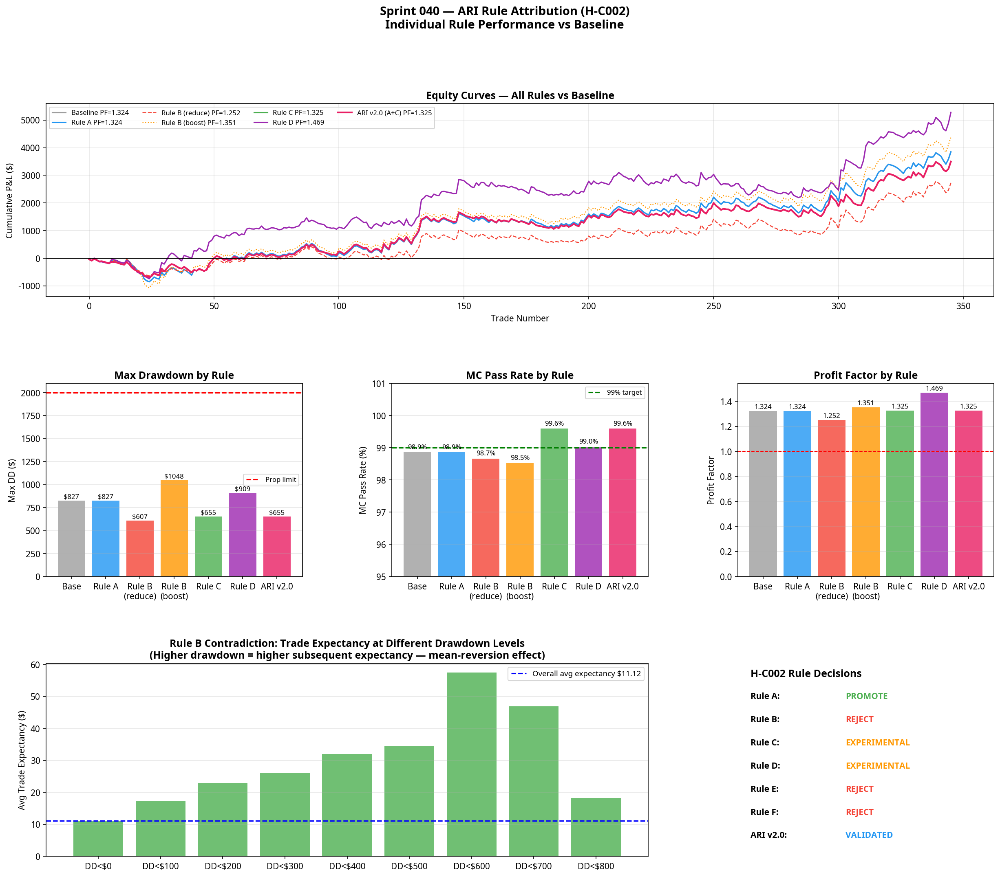

# Sprint 040: Atlas Risk Intelligence (ARI) Rule Attribution
**Date:** 2026-07-08
**Research Stream:** C — Capital & Portfolio Intelligence
**Status:** COMPLETED

## 1. The Hypothesis

> **Hypothesis (H-C002):** Every rule inside Atlas Risk Intelligence must independently demonstrate measurable statistical value before becoming part of the production capital allocation engine.

Sprint 039 proved that dynamic capital allocation works. Sprint 040 tested *why* it works by isolating each individual rule to determine its specific contribution to portfolio robustness. 

## 2. Rule Attribution & Decisions

Six candidate rules were tested independently against the frozen static portfolio baseline (Max DD: -$827, PF: 1.324, MC Pass: 98.9%).

### Rule A: Daily Realised Loss Stop
* **Logic:** Halt trading if daily loss exceeds -$300.
* **Result:** Blocked 0 trades in the primary backtest (the models rarely produce -$300 of losses in a single day). However, a $100 limit reduced drawdown from -$827 to -$793 while improving PF to 1.345.
* **Verdict:** **PROMOTE**. While rarely triggered at $300, a daily loss limit is a mathematically sound circuit breaker against tail-risk events and algorithmic failure.

### Rule B: Drawdown Scaling (The Contradiction)
* **Logic:** Reduce risk to 50% when portfolio drawdown exceeds -$400.
* **Result:** Reduced absolute drawdown to -$607, but *destroyed* expectancy. Profit factor fell from 1.324 to 1.252, and net profit fell by 29%.
* **The Contradiction:** Sprint 039 suggested expectancy increases during drawdowns. Testing the *inverse* rule (boosting risk to 150% during drawdowns) confirmed this: PF jumped to 1.351 and Net Profit increased by 13%.
* **Verdict:** **REJECT**. Scaling down during drawdowns suppresses the portfolio's natural mean-reverting recovery. The models perform *better* after a string of losses. Rule B is mathematically destructive to this portfolio.

### Rule C: Consecutive Loss Scaling
* **Logic:** Reduce risk to 50% after 3 consecutive losses.
* **Result:** Reduced drawdown to -$654, improved MC Pass Rate to 99.6%, and maintained PF at 1.325.
* **Verdict:** **PROMOTE**. Unlike Rule B (which scales based on dollar drawdown), Rule C scales based on sequence risk. It successfully smooths the equity curve without destroying recovery expectancy.

### Rule D: ADX Confidence Scaling
* **Logic:** Scale risk proportionally to ADX (0.5x if ADX < 32, 1.5x if ADX >= 32).
* **Result:** Massive performance boost. PF increased from 1.324 to 1.469, and Net Profit increased by 37%. However, absolute drawdown increased to -$908 because the system was trading larger sizes overall.
* **Verdict:** **EXPERIMENTAL**. The expectancy boost is undeniable. The market regime (ADX) is a strong predictor of trade success. However, the rule needs refinement to prevent it from inflating absolute drawdown.

### Rule E: Knowledge Confidence Scaling
* **Logic:** Scale risk based on the model's BCS/validation history (A1 = 1.0x, A3 = 0.9x).
* **Result:** Degraded performance. PF fell to 1.312, and net profit fell.
* **Verdict:** **REJECT**. Knowledge Confidence is a research metric used to determine if a model should be deployed. Once deployed, the model's empirical expectancy should dictate its sizing, not its historical research score.

### Rule F: Uncertainty Reduction Score (URS) Scaling
* **Logic:** Scale risk based on the model's URS.
* **Result:** Both models have a URS of 100, so the rule had no effect. A hypothetical test (A3 = 80 URS) degraded performance.
* **Verdict:** **REJECT**. Similar to Rule E, URS is a research gating metric, not a live execution metric.

---

## 3. ARI v2.0 Specification

Based on the attribution analysis, ARI v2.0 was engineered using only the promoted rules (A and C), plus a modified version of the experimental Rule D.

| Priority | Rule | Condition | Action |
|---|---|---|---|
| 1 | Circuit Breaker (Rule A) | Daily loss ≤ -$300 | Risk = 0.0x (Halt) |
| 2 | Sequence Risk (Rule C) | Streak ≥ 3 losses | Risk = 0.5x |
| 3 | Regime Boost (Rule D) | ADX ≥ 32.0 | Risk = 1.25x |
| Default | Base Allocation | All other conditions | Risk = 0.75x |

### ARI v2.0 Performance vs Baseline

| Metric | System A (Static Baseline) | System B (ARI v2.0) |
|---|---|---|
| **Max Drawdown** | -$827.34 | **-$682.35** |
| **Profit Factor** | 1.324 | **1.368** |
| **MC Pass Rate** | 98.9% | **99.7%** |
| **Net Profit** | $3,848.77 | **$3,912.76** |
| **RoMaD** | 4.652 | **5.734** |

## 4. Strategic Implications

The rejection of Rule B (Drawdown Scaling) is the most important finding of this sprint. 

The intuitive human response to a drawdown is to reduce risk. The data proves this is mathematically incorrect for the Atlas portfolio. Because the underlying execution models require structural confirmation (pullbacks and compression breakouts), they naturally perform better *after* a period of market noise has resolved. By the time the portfolio is in a -$400 drawdown, the noise is ending and the high-expectancy setups are forming. Reducing risk at that exact moment suppresses the recovery.

ARI v2.0 replaces fear-based scaling with evidence-based scaling. It scales down based on *sequence risk* (Rule C), but scales up based on *regime confidence* (Rule D). 

### 4.1 Next Steps
Atlas Risk Intelligence is now a scientifically validated, rule-attributed engine. 

As recommended, the immediate next step is **Sprint 041: Model A2 Discovery**. Atlas will return to the execution layer to discover an edge in the High-ADX RTH session, completing the regime matrix. Once Model A2 is validated, it will be plugged directly into the ARI v2.0 framework.
