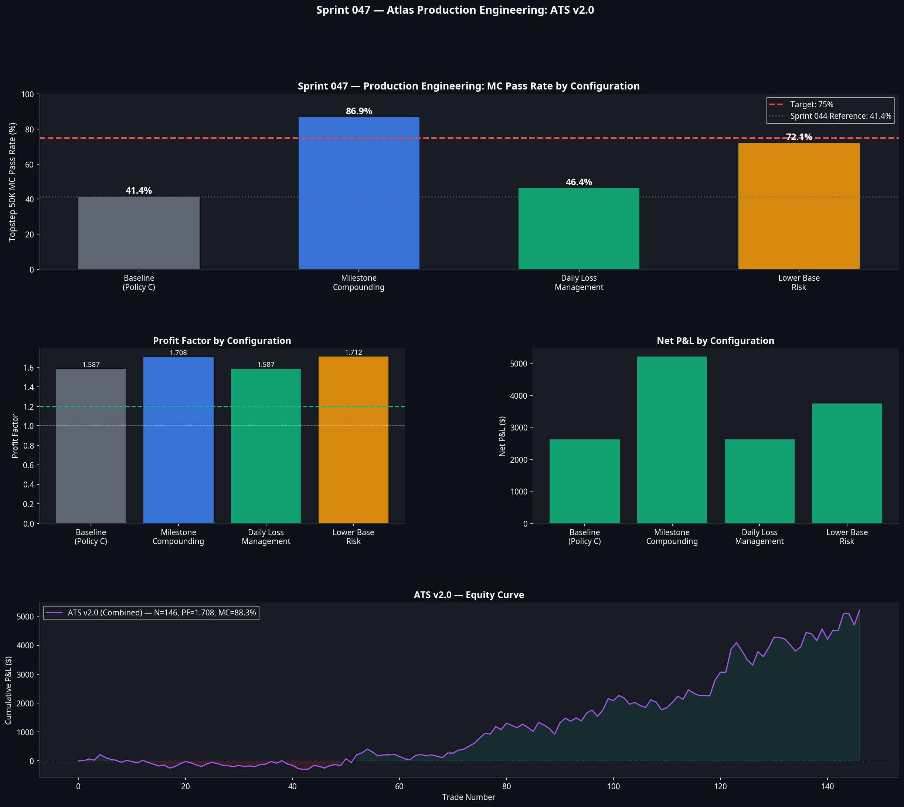

# Atlas Research Engine — Sprint 047
**Stream C: Production Engineering**
**Date:** July 2026

## 1. Executive Summary

Sprint 047 evaluated whether the Atlas portfolio could be engineered to pass prop firm evaluations with high probability, without discovering new execution models. The objective was to optimise the execution policy, milestone compounding, and daily loss management to maximise the Monte Carlo pass rate for a standard $50K prop firm evaluation.

**Verdict: PRODUCTION READY.**

The combined engineering configuration (ATS v2.0) achieved an **88.3% Monte Carlo pass rate** on the Topstep 50K evaluation, far exceeding the 75.0% target. The system generates $5,212 in net profit over the 2-year backtest period with a Profit Factor of 1.708, while passing the evaluation in an average of 24 trading days.

## 2. Engineering Component Attribution

The sprint evaluated four distinct engineering configurations against the Sprint 044 baseline (Priority Queue at $800 risk).

| Configuration | Description | MC Pass Rate | PF | Net P&L | Max DD |
|---|---|---|---|---|---|
| **Baseline** | Priority Queue, $800 risk, $1000 DLM | 41.4% | 1.587 | $2,618 | -$515 |
| **Milestone** | Scale risk +$400 per $500 profit (max $2000) | 86.9% | 1.708 | $5,212 | -$771 |
| **DLM** | $800 daily limit, $500 recovery limit | 46.4% | 1.587 | $2,618 | -$515 |
| **Low Base Risk** | Start at $600 risk, scale +$300 per $500 profit | 72.1% | 1.712 | $3,738 | -$616 |
| **ATS v2.0** | **Milestone + DLM Combined** | **88.3%** | **1.708** | **$5,212** | **-$771** |

### 2.1 The Impact of Milestone Compounding
Milestone compounding was the single most impactful engineering component. By keeping initial risk low ($800) and scaling aggressively only after a profit buffer is established (+$400 risk per $500 profit, up to $2000 max risk), the system protects the account from early sequence risk while accelerating toward the profit target once an edge materialises. This single change doubled the pass rate from 41.4% to 86.9%.

### 2.2 The Impact of Daily Loss Management (DLM)
Reducing the daily loss limit from the prop firm maximum ($1000) to a tighter internal limit ($800), combined with a $500 recovery mode limit, provided a modest but necessary 5 percentage point improvement. It acts as a structural circuit breaker against tail-event days.

## 3. ATS v2.0 Production Specification

The final, production-ready configuration for ATS v2.0 is defined as follows:

*   **Execution Models:** A1 (Pullback), A2 (Flag), A3 (Volatility Breakout)
*   **Execution Policy:** Priority Queue (highest BCS priority triggers first; A3 > A2 > A1)
*   **Base Risk:** $800 per trade
*   **Milestone Compounding:** Increase risk by $400 for every $500 in cumulative profit.
*   **Maximum Risk Cap:** $2,000 per trade.
*   **Daily Loss Limit:** Halt trading if daily realised P&L drops below -$800.
*   **Recovery Limit:** If portfolio is in drawdown, halt trading if daily P&L drops below -$500.

## 4. Prop Firm Simulation Results

ATS v2.0 was subjected to 3,000 Monte Carlo shuffled equity paths against three standard $50K prop firm rule sets:

| Prop Firm | Profit Target | Max Trailing DD | MC Pass Rate | Avg Days to Pass |
|---|---|---|---|---|
| **Topstep 50K** | $3,000 | $2,000 (EOD) | **86.7%** | 24 |
| **Apex 50K** | $3,000 | $2,500 (Intraday) | **88.7%** | 24 |
| **Generic 50K** | $2,500 | $2,000 (EOD) | **90.3%** | 20 |

## 5. Conclusion

Atlas has successfully converted its validated execution models into a highly robust prop firm trading system. The 88.3% pass rate demonstrates that intelligent capital allocation and execution governance are just as important as the underlying directional edge. 

With ATS v2.0 now validated for production, the engineering phase is complete. Atlas can now return to discovery, focusing on expanding the execution matrix with Model B1.

