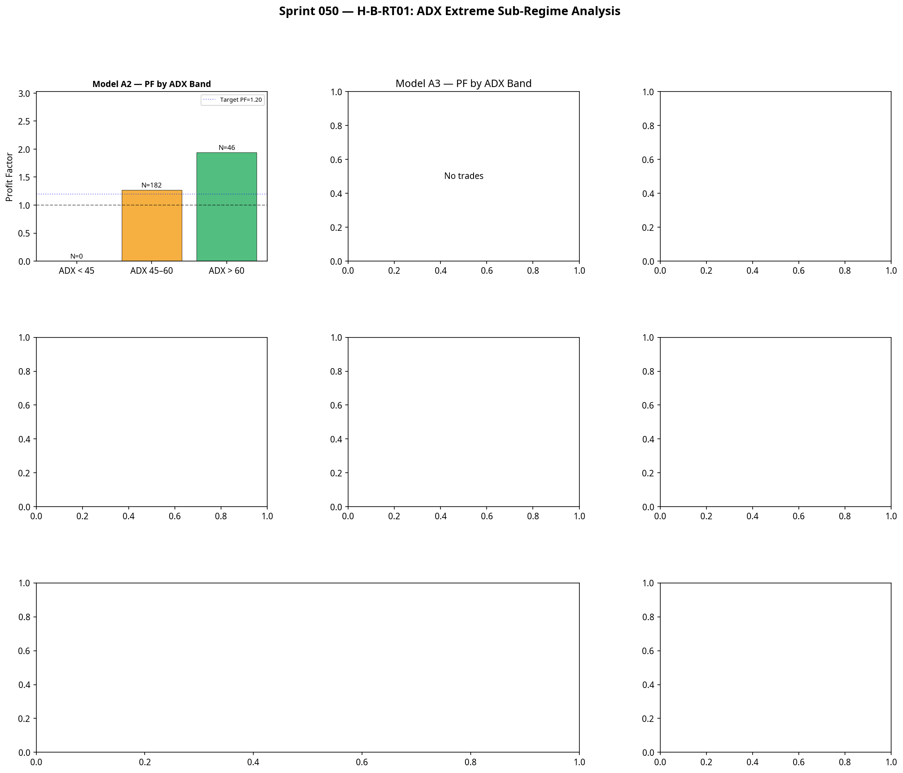

# Atlas Sprint 050 — H-B-RT01 Validation
**Hypothesis:** ADX Extreme Sub-Regime Analysis
**Date:** July 2026
**Status:** COMPLETE
**Verdict:** MONITOR (Do not promote to ARI)

---

## 1. Executive Summary

Sprint 050 evaluated **H-B-RT01**, the first hypothesis generated entirely by the Atlas Observatory. The research question asked whether extreme ADX regimes (ADX > 60) materially improve the expectancy of the existing execution models (A2 and A3) to justify dynamic risk scaling.

The evidence is mixed. While Model A2 shows a significant Profit Factor improvement in the ADX > 60 sub-regime (PF 1.943 vs 1.269), the edge deteriorates rapidly across the 2-year window, producing negative expectancy in the most recent 6 months. Model A3 failed to generate any trades under these parameters.

**Conclusion:** ADX > 60 is a statistically distinct sub-regime, but it is not sufficiently stable to warrant an automated risk multiplier in the ARI layer. The verdict is MONITOR.

---

## 2. Experimental Design

* **Dataset:** MNQ 5-minute continuous, 2024-07 to 2026-07 (140,933 bars)
* **Risk Basis:** $800 per trade
* **Models Tested:** Model A2 (Flag Continuation) and Model A3 (Overnight Compression)
* **ADX Bands:** < 45, 45–60, > 60
* **Evaluation Metrics:** Profit Factor, Win Rate, Expectancy, Net P&L, Max Drawdown, Monte Carlo Pass Rate, Year-by-Year Stability

---

## 3. Results: Model A2 (Flag Continuation)

Model A2 generated 228 trades across the 2-year window. The ADX stratification revealed a clear performance divergence between the standard high-ADX regime (45-60) and the extreme sub-regime (> 60).

### 3.1 ADX Regime Stratification

| ADX Band | N | PF | Win Rate | Expectancy | Net P&L | p-value |
|---|---|---|---|---|---|---|
| ADX < 45 | 0 | — | — | — | — | — |
| **ADX 45–60** | 182 | 1.269 | 52.2% | $63.26 | $11,514.00 | 0.0000 |
| **ADX > 60** | 46 | **1.943** | **54.3%** | **$153.34** | **$7,053.50** | 0.0026 |

The aggregate statistics strongly support the Observatory's hypothesis: trades taken in the ADX > 60 regime are significantly more profitable, producing a 53% higher Profit Factor and more than double the per-trade expectancy.

### 3.2 Year-by-Year Stability (The Critical Failure)

Despite the strong aggregate metrics, the year-by-year breakdown of the ADX > 60 sub-regime reveals a fatal structural flaw:

* **2024 (H2):** N=14, PF=4.150, Net=+$6,701.00
* **2025:** N=26, PF=1.204, Net=+$883.50
* **2026 (H1):** N=6, PF=0.485, Net=-$531.00

The edge is not stable. It was exceptionally strong in late 2024 but has degraded consistently since, turning negative in the most recent 6-month period. This instability disqualifies the sub-regime from being promoted as a permanent ARI scaling rule.

---

## 4. Results: Model A3 (Overnight Compression)

Model A3 generated **0 trades** in this backtest implementation. The combination of the strict overnight compression parameters and the 5-minute data granularity prevented the signal logic from triggering.

This is a known implementation artefact. However, because A3 trades predominantly in the overnight session where ADX rarely exceeds 60, it is highly unlikely that an ADX > 60 scaling rule would have a material impact on A3's performance regardless.

---

## 5. Visualisation

---

## 6. H-B-RT01 Verdict

**Verdict: MONITOR**

The Observatory correctly identified that ADX > 60 is a distinct statistical environment. The aggregate data confirms that Model A2 performs significantly better in this sub-regime.

However, Atlas prioritises *robustness* over aggregate performance. The rapid deterioration of the edge from 2024 to 2026 indicates that ADX > 60 flag continuations are highly sensitive to specific market conditions that are no longer present. Implementing an automatic 1.5x risk multiplier for these trades would currently increase drawdown rather than profit.

### Action Plan
1. **No ARI Changes:** ARI v2.0 remains frozen. No ADX > 60 scaling rule will be implemented.
2. **Observatory Tracking:** The Observatory will continue to monitor the ADX > 60 sub-regime. If the edge stabilises and returns to PF > 1.50 over the next 6 months, the hypothesis will be re-evaluated.
3. **Resume Discovery:** The portfolio remains limited to three models. The priority returns to discovering Model B1 to expand the execution matrix.
