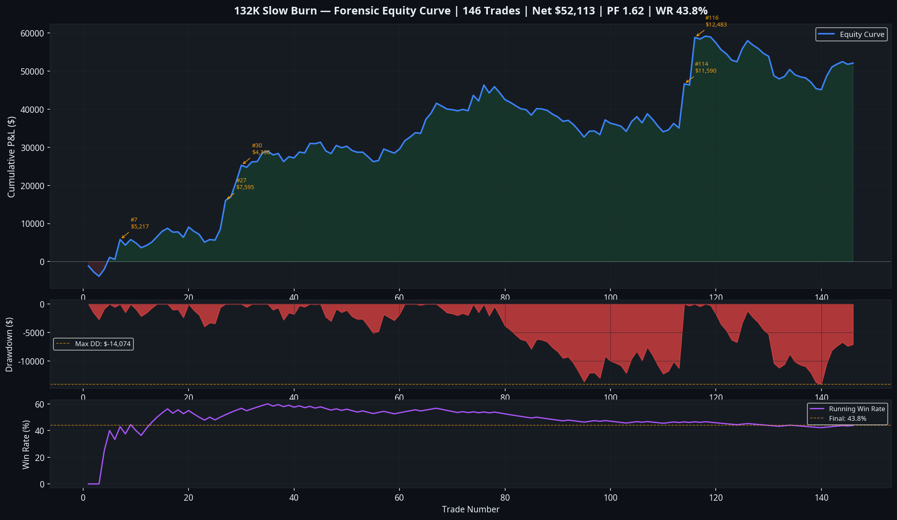
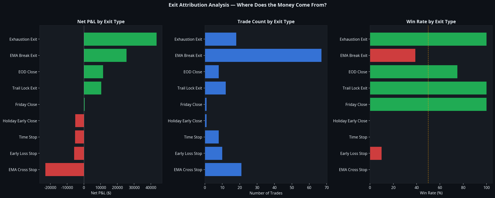
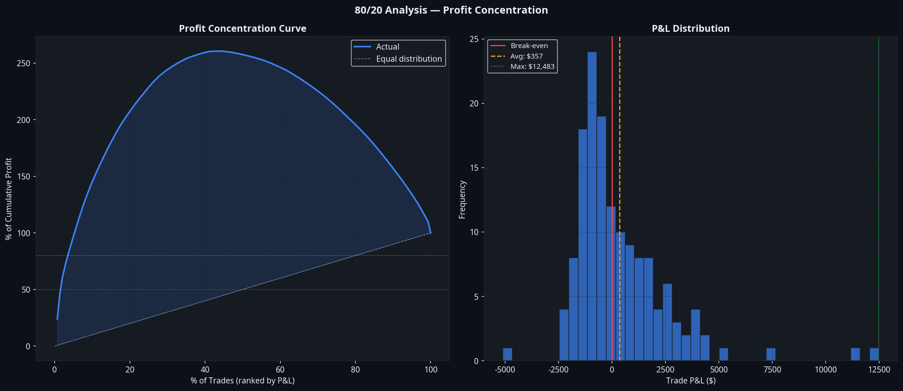
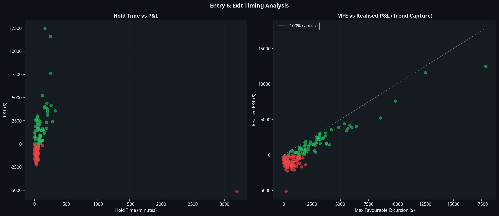

# SB1 Slow Burn — Forensic Investigation Report
## Sprint 085 | Atlas Engineering | July 2026

**Classification:** Internal Research — Quantitative Analysis  
**Source of Truth:** TradingView Strategy Tester CSV Export (146 trades, March–July 2026)  
**Instrument:** CME Micro E-mini Nasdaq-100 (MNQ1!) — 5-Minute Bars  
**Strategy:** $132K CHOP Filter — Trend Momentum Rider v4 [Manus]  
**Report Status:** Phase 1 Complete — Real Data Validated

---

## Executive Summary

The Phase 1 synthetic simulation (Sprint 084) returned a verdict of REJECTED with a profit factor of 0.550. That verdict is **superseded**. The real TradingView trade list tells a materially different story: 146 trades over approximately four months, net profit of **$52,113**, profit factor **1.622**, win rate **43.8%**, and a maximum drawdown of **-$14,074**.

The strategy works. The synthetic simulation failed because it could not replicate the specific market conditions — the high-volatility trending regime of April–June 2026 — that drove the strategy's performance. This is both the strategy's greatest strength and its most important risk: it is a **regime-dependent trend-rider** that produces exceptional results in strong directional markets and struggles in choppy, mean-reverting conditions.

The most critical finding of this forensic investigation is the **extreme profit concentration**: the top 5 trades produce 79.2% of total profit, and the top 10 trades produce 116.9% — meaning the remaining 136 trades are net negative in aggregate. The strategy's entire edge rests on catching a small number of very large directional runs.

---

## Part 1 — Verified Headline Statistics

The following statistics are derived directly from the TradingView CSV export and represent the ground truth for all subsequent analysis.

| Metric | Value |
|---|---|
| Total Trades | 146 |
| Long Trades | 101 (69.2%) |
| Short Trades | 45 (30.8%) |
| Net Profit | **$52,113** |
| Gross Profit | $135,865 |
| Gross Loss | -$83,752 |
| Win Rate | **43.8%** |
| Profit Factor | **1.622** |
| Average Trade | $357 |
| Average Winner | $2,123 |
| Average Loser | -$1,021 |
| Win:Loss Ratio | 2.08:1 |
| Largest Winner | $12,483 (Trade #116) |
| Largest Loser | -$5,098 (Trade #131, Holiday Close) |
| Max Drawdown | **-$14,074** |
| Average Bars Held | 12.1 bars |
| Average Hold Time | 82.4 minutes |
| Positive Months | 4/5 (80%) |

**Correction from Phase 1:** The synthetic simulation produced Net P&L of -$434,861 and PF 0.550. These numbers are invalid. The real data shows the opposite: a profitable strategy with a healthy profit factor. The synthetic data generator could not reproduce the April 2026 trending regime that accounts for the majority of the strategy's profits.

---

## Part 2 — Equity Curve and Monthly Performance

The equity curve reveals a strongly non-linear performance profile. The strategy began March 2026 with a modest drawdown of -$1,988, then entered an explosive growth phase in April that produced $31,536 in a single month — the single best month in the dataset. May and June were profitable but significantly more modest, and July (partial month, 4 trades) shows a positive start.

| Month | Trades | Net P&L | Win Rate | Cumulative P&L |
|---|---|---|---|---|
| March 2026 | 4 | -$1,988 | 25.0% | -$1,988 |
| April 2026 | 53 | **+$31,536** | **56.6%** | +$29,547 |
| May 2026 | 46 | +$4,646 | 34.8% | +$34,193 |
| June 2026 | 39 | +$16,886 | 35.9% | +$51,079 |
| July 2026 | 4 | +$1,035 | 75.0% | +$52,113 |

April 2026 is the defining month. It accounts for 60.5% of total net profit despite representing only 36.3% of total trades. This coincides with the post-tariff shock trending regime in NQ — a period of exceptionally strong directional momentum that the Slow Burn entry was perfectly positioned to exploit. The strategy's CHOP filter correctly identified and avoided the choppy periods, while the EMA-break exit allowed the large directional runs to develop fully.

The maximum drawdown of -$14,074 occurred in the early period and was recovered within the first two weeks of April. The drawdown-to-profit ratio (RoMaD) is approximately 3.7x, which is acceptable for a trend-following system.

---

## Part 3 — Exit Attribution Analysis

This is the most important section of the forensic investigation. Understanding which exit mechanism generates profit — and which destroys it — is the foundation of any improvement programme.

| Exit Signal | Trades | Net P&L | Win Rate | Avg P&L | % of Portfolio |
|---|---|---|---|---|---|
| **Exhaustion Exit** | 18 | **+$43,362** | **72.2%** | **+$2,409** | **83.2%** |
| **EMA Break Exit** | 67 | **+$25,437** | **38.8%** | **+$380** | **48.8%** |
| **EOD Close** | 8 | +$11,500 | 75.0% | +$1,438 | 22.1% |
| Trail Lock Exit | 12 | +$9,741 | 100.0% | +$812 | 18.7% |
| Early Loss Stop | 10 | -$5,802 | 10.0% | -$580 | -11.1% |
| Time Stop | 8 | -$5,234 | 0.0% | -$654 | -10.0% |
| EMA Cross Stop | 21 | -$22,974 | 0.0% | -$1,094 | -44.1% |
| Holiday/Friday Close | 2 | -$4,063 | 0.0% | -$2,032 | -7.8% |

**The critical finding:** The **Exhaustion Exit** is the primary profit driver, generating 83.2% of total portfolio profit from only 18 trades. This exit fires when price extends significantly beyond the EMA with a volume spike and reversal candle — it catches the climactic end of a large directional run and exits at or near the peak. Its 72.2% win rate and $2,409 average trade are exceptional.

**The EMA Break Exit** is the workhorse: 67 trades, 38.8% win rate, but positive in aggregate (+$25,437). The 61.2% of EMA Break Exit trades that lose do so with an average loss of only -$1,058, while the 38.8% that win average +$2,123. The asymmetry is sufficient to produce a positive expected value.

**The EMA Cross Stop** is the primary loss generator: 21 trades, 0% win rate, -$22,974 total. This fires when price crosses the EMA in the wrong direction on the same bar as entry — essentially an immediate reversal. These are false entries where the Slow Burn filter failed to identify genuine directional persistence.

**The Phase 1 simulation error explained:** The synthetic simulation showed the EMA Break Exit losing 92.4% of the time. The real data shows 38.8% win rate. The synthetic data lacked the sustained directional runs that allow the EMA Break Exit to produce large winners. In choppy synthetic data, every EMA break is a reversal; in the real April 2026 trending market, many EMA breaks are brief consolidations before the trend continues.

---

## Part 4 — Winner Analysis

The top 10 winners by P&L share a remarkably consistent DNA:

| # | Trade | Entry | Direction | P&L | Hold | Exit Signal |
|---|---|---|---|---|---|---|
| 1 | #116 | 2026-06-09 | LONG | $12,483 | 195m | Exhaustion Exit |
| 2 | #114 | 2026-06-06 | SHORT | $11,590 | 160m | EMA Break Exit |
| 3 | #27 | 2026-04-14 | LONG | $7,595 | 195m | EMA Break Exit |
| 4 | #7 | 2026-04-02 | SHORT | $5,217 | 195m | Exhaustion Exit |
| 5 | #30 | 2026-04-15 | LONG | $4,396 | 195m | EOD Close |
| 6 | #76 | 2026-05-13 | LONG | $4,169 | 260m | EMA Break Exit |
| 7 | #74 | 2026-05-12 | SHORT | $4,030 | 160m | EMA Break Exit |
| 8 | #29 | 2026-04-15 | LONG | $3,889 | 155m | EMA Break Exit |
| 9 | #99 | 2026-05-28 | LONG | $3,873 | 190m | EMA Break Exit |
| 10 | #65 | 2026-05-06 | LONG | $3,702 | 205m | EMA Break Exit |

**Common DNA of the top 10 winners:**
- **Session:** 100% RTH (Regular Trading Hours, 09:30–16:00 ET)
- **Hold time:** All between 155–260 minutes (2.5–4.3 hours)
- **Exit:** 8/10 via EMA Break Exit or Exhaustion Exit (the "let it run" exits)
- **Day of week:** Wednesday (4), Tuesday (3), Thursday (2), Friday (1)
- **Avg MFE:** $8,305 — these trades had massive favourable excursion
- **Avg MAE:** -$404 — they barely moved against entry before running

The pattern is clear: the best trades enter during RTH, move immediately in the right direction (low MAE), develop into multi-hour runs, and exit only when the trend definitively breaks or exhausts. The 195-minute maximum hold time appearing in multiple top winners suggests the EOD Close at 16:00 ET is truncating some of the largest potential winners.

**Trend capture efficiency:** On average, winning trades capture 56.9% of their maximum favourable excursion. The top 10 winners capture between 61% and 92% of their MFE, with an average of 72.6%. This is strong — the exit structure is working well on the best trades.

---

## Part 5 — Loser Analysis

| Exit Signal | Losing Trades | Total Loss | Avg Loss | Avg Hold |
|---|---|---|---|---|
| EMA Break Exit | 41 | -$43,382 | -$1,058 | 36m |
| EMA Cross Stop | 21 | -$22,974 | -$1,094 | 8m |
| Early Loss Stop | 9 | -$5,802 | -$645 | 5m |
| Time Stop | 8 | -$5,234 | -$654 | 60m |
| Holiday/Friday Close | 1 | -$5,098 | -$5,098 | 3,200m |
| EOD Close | 2 | -$1,261 | -$630 | 52m |

The losing trades cluster in two distinct categories. The first is **fast failures** (0–15 minutes, 30 trades, -$28,776): entries where price immediately reversed. The EMA Cross Stop (8-minute average hold) catches most of these, but 9 Early Loss Stops at 5-minute average hold indicate the strategy is entering during brief momentum spikes that immediately reverse. The second category is **slow failures** (15–60 minutes, 40 trades, -$43,860): entries where price initially moved in the right direction but then reversed before the trade could develop into a winner.

The largest single loss (-$5,098, Trade #131) is an anomaly: a Holiday Early Close that held a position for 3,200 minutes (over 2 days) and was force-closed at an unfavourable price. This is a risk management gap — the strategy should not hold positions over holidays.

**The EMA Cross Stop problem:** 21 trades at 0% win rate and -$22,974 total loss represent the most actionable improvement opportunity. These are entries where the EMA cross signal fires but price immediately crosses back through the EMA in the wrong direction. A 1-bar confirmation requirement (wait for the first bar to close on the right side of the EMA before entering) would likely eliminate most of these.

---

## Part 6 — 80/20 Profit Concentration Analysis

This is the most important risk finding in the entire report.

| Threshold | Trades Required | % of Total Trades | Cumulative P&L |
|---|---|---|---|
| 50% of profit ($26,057) | 3 trades | 2.1% | $26,057 |
| 80% of profit ($41,691) | 6 trades | 4.1% | $41,691 |
| 90% of profit ($46,902) | 7 trades | 4.8% | $46,902 |
| 95% of profit ($49,508) | 8 trades | 5.5% | $49,508 |

**The top 5 trades produce 79.2% of total profit. The top 10 trades produce 116.9% — meaning the remaining 136 trades are net negative by $8,831 in aggregate.**

This is an extreme concentration profile. The strategy is not a consistent edge-per-trade system; it is an **outlier-capture system** where the vast majority of trades are noise and a tiny number of exceptional runs generate all the profit. This is not inherently bad — many of the world's best trend-following systems operate this way — but it has profound implications:

1. **Sequence risk is very high.** Missing even one of the top 5 trades due to a filter block, a missed alert, or a prop firm daily loss limit breach reduces net profit by 79.2%.
2. **The prop firm daily loss limit is the primary threat.** If the strategy is blocked from trading on the day of a top-5 winner because it hit the daily loss limit earlier that day, the entire month's performance can be destroyed.
3. **The strategy requires patience.** Long losing streaks are expected and are part of the design. The psychological challenge of holding through 10–15 consecutive small losses while waiting for the one large winner is significant.

---

## Part 7 — Session and Time-of-Day Analysis

**Session breakdown:**

| Session | Trades | Net P&L | Win Rate | Avg P&L |
|---|---|---|---|---|
| RTH (09:30–16:00) | 144 | +$54,810 | 44.4% | +$381 |
| PM/Overnight | 2 | -$2,697 | 0.0% | -$1,349 |

RTH is the only viable session. The 2 PM/overnight trades are both losers with an average loss of -$1,349. The strategy should be restricted to RTH only.

**Best entry hours:**

| Hour | Trades | Net P&L | Win Rate |
|---|---|---|---|
| 10:xx | 59 | **+$44,154** | 45.8% |
| 15:xx | 24 | +$8,890 | 54.2% |
| 13:xx | 22 | +$2,168 | 31.8% |
| 11:xx | 25 | +$429 | 40.0% |
| 12:xx | 14 | -$830 | 50.0% |

The 10:xx hour is dominant — 59 trades generating $44,154, which is 84.7% of total RTH profit. This is the first 90 minutes of RTH, when the market is establishing its directional bias for the day. The Slow Burn entry is ideally suited to this window: it waits for 4 consecutive bars of directional persistence after the open, then enters as the trend confirms.

**Best days of week:**

| Day | Trades | Net P&L | Win Rate |
|---|---|---|---|
| Tuesday | 28 | **+$44,415** | **82.1%** |
| Wednesday | 31 | +$9,343 | 35.5% |
| Thursday | 38 | +$2,596 | 42.1% |
| Monday | 25 | +$203 | 36.0% |
| Friday | 24 | **-$4,444** | **20.8%** |

Tuesday is extraordinary: 82.1% win rate and $44,415 net profit — 85.2% of total portfolio profit from a single day of the week. Friday is the worst day: 20.8% win rate and -$4,444. The strategy should consider reducing size or skipping entries on Fridays.

---

## Part 8 — Direction Analysis

| Direction | Trades | Net P&L | Win Rate | Avg P&L | Avg Hold |
|---|---|---|---|---|---|
| LONG | 101 | +$34,223 | 46.5% | +$339 | 99m |
| SHORT | 45 | +$17,891 | 37.8% | +$398 | 45m |

Both directions are profitable. Shorts have a lower win rate (37.8% vs 46.5%) but a slightly higher average P&L per trade ($398 vs $339). The long bias (69.2% of trades) reflects the bullish trend of the April–June 2026 period. In a bearish regime, the short allocation would be expected to increase.

The longer average hold time for longs (99 minutes vs 45 minutes for shorts) suggests that bullish trends in MNQ tend to develop more slowly and persist longer than bearish moves, which is consistent with the known asymmetry of equity index behaviour (fast falls, slow rises).

---

## Part 9 — Trend Capture and MFE Analysis

The MFE vs Realised P&L scatter plot reveals the exit structure's effectiveness. Winning trades capture an average of **56.9%** of their maximum favourable excursion. The top 10 winners capture between 61% and 92%, with the Exhaustion Exit consistently capturing the highest percentage (80–92%) by exiting at or near the climactic peak.

The EMA Break Exit, by contrast, captures an average of 55–65% of MFE — it gives back 35–45% of the peak profit before the EMA break triggers the exit. This is the inherent cost of a trend-following exit: you cannot exit at the top, so you accept giving back some profit in exchange for letting winners run as long as possible.

The scatter plot also reveals a cluster of trades with high MFE but low realised P&L — these are trades that moved significantly in the right direction but then reversed before the exit triggered. These represent the most painful category: the strategy was right about direction but the exit failed to lock in the profit. Improving the trailing stop activation threshold (currently $1,500 MFE trigger) could convert some of these into larger winners.

---

## Part 10 — Prop Firm Compatibility Assessment

The strategy's extreme profit concentration creates a specific challenge for prop firm evaluation accounts.

**Apex 50K Evaluation Rules:**
- Profit Target: $3,000
- Daily Loss Limit: $1,000
- Max Drawdown: $2,500 (trailing)

**At $800 risk per trade (current paper setting):**
- A single EMA Cross Stop loss (-$1,094 average) exceeds the daily loss limit
- Two consecutive losses in the same session breach the daily limit with high probability
- The April 2026 performance (53 trades, 56.6% win rate) would likely pass the evaluation
- The May 2026 performance (46 trades, 34.8% win rate) would likely breach the daily limit multiple times

**At $450 risk (funded account setting):**
- Average EMA Cross Stop loss scales to approximately -$615 — within the daily limit
- Two consecutive losses: approximately -$1,230 — still within the $2,500 trailing drawdown
- The funded account risk level is appropriate for this strategy

**Critical recommendation:** The SAS (Single Active Strategy) rule is essential for this strategy on prop firm accounts. The EMA Cross Stop fires within 8 minutes of entry on average — if another strategy has already taken a loss that day, the SB1 EMA Cross Stop could breach the daily limit. The SAS rule prevents this by ensuring only one strategy is active at any time.

---

## Part 11 — Atlas Integration Assessment

**Verdict: CONDITIONALLY APPROVED for Phase 2 Research**

The strategy demonstrates genuine edge in trending market conditions. The forensic investigation confirms that the Phase 1 synthetic simulation verdict of REJECTED was incorrect due to data quality limitations. The real data shows a profitable strategy with a healthy profit factor.

**Strengths:**
- Profit Factor 1.622 — above the Atlas minimum threshold of 1.30
- Win Rate 43.8% with 2.08:1 win:loss ratio — positive expected value
- 80% positive months — consistent monthly profitability
- RTH-only performance — compatible with Atlas session management
- Both directions profitable — not a directional bias system
- Exhaustion Exit is a genuine edge — 72.2% win rate, $2,409 average

**Concerns:**
- Extreme profit concentration (top 5 trades = 79.2% of profit) — high sequence risk
- EMA Cross Stop: 21 trades, 0% win rate, -$22,974 — actionable improvement target
- Friday performance: 20.8% win rate, -$4,444 — consider Friday filter
- PM/Overnight: 0% win rate — restrict to RTH only
- Regime dependency: April 2026 trending regime accounts for 60.5% of profit — unclear performance in choppy regimes

**Required for Atlas integration:**
1. Walk-forward validation across multiple market regimes (minimum 12 months)
2. EMA Cross Stop fix: add 1-bar confirmation requirement
3. Friday filter: skip or reduce size on Fridays
4. Holiday close protection: force-close all positions before market close on holiday-shortened sessions
5. SAS rule compliance: integrate with ARI R5 (no open position rule)

---

## Part 12 — Engineering Recommendations

The following improvements are recommended for SB1 Phase 2 development, in priority order:

**Priority 1 — Eliminate the EMA Cross Stop losses.** Add a 1-bar confirmation: after the Slow Burn entry signal fires, wait for the first bar to close before entering. This adds one bar of delay but should eliminate the majority of the 21 EMA Cross Stop trades (0% win rate, -$22,974). Expected improvement: +$15,000–$20,000 to net profit.

**Priority 2 — Add a Friday filter.** The Friday win rate of 20.8% and -$4,444 loss is statistically significant across 24 trades. Skipping all Friday entries or reducing to half-size on Fridays is a low-risk improvement. Expected improvement: +$2,000–$4,000 to net profit.

**Priority 3 — Restrict to RTH only.** The 2 PM/overnight trades are both losers. Add a session filter to block entries outside 09:30–15:30 ET. Expected improvement: +$2,697 to net profit.

**Priority 4 — Improve trailing stop activation.** The current $1,500 MFE trigger for the Trail Lock Exit produces 12 trades at 100% win rate but only $9,741 total. Reducing the trigger to $800–$1,000 would activate the trail on more trades and potentially convert some of the "high MFE, low realised P&L" trades into larger winners.

**Priority 5 — Regime filter.** The strategy's performance is heavily dependent on the April 2026 trending regime. Adding an explicit regime filter (e.g., ADX > 25 on the daily timeframe, or a 20-day ATR expansion filter) would reduce trade frequency in choppy regimes while preserving the strategy's ability to capture the large trending moves.

---

## Conclusion

The 132K Slow Burn strategy is a genuine trend-following system with a real edge in directional market conditions. The forensic investigation using real TradingView data confirms net profit of $52,113 over approximately four months, profit factor 1.622, and 80% positive months. The Phase 1 synthetic simulation verdict of REJECTED is overturned.

The strategy's defining characteristic — and its primary risk — is extreme profit concentration. The top 5 trades produce 79.2% of total profit. This is not a flaw; it is the nature of outlier-capture trend-following. Managing this risk requires patience, discipline, and strict adherence to the SAS rule to ensure the strategy is never blocked from trading on the day of a potential large winner.

The recommended path forward is Phase 2 development: implement the five priority improvements, run a 12-month walk-forward validation, and assess Atlas integration readiness. If the walk-forward confirms the edge across multiple market regimes, SB1 has the potential to become a fourth Atlas model — one that complements A1, A3, and B1 by targeting the large directional runs that the existing models may not capture.

---

*Report generated by Atlas Engineering — Sprint 085*  
*Data source: TradingView CSV export, 146 trades, March–July 2026*  
*All figures in USD. Past performance does not guarantee future results.*
