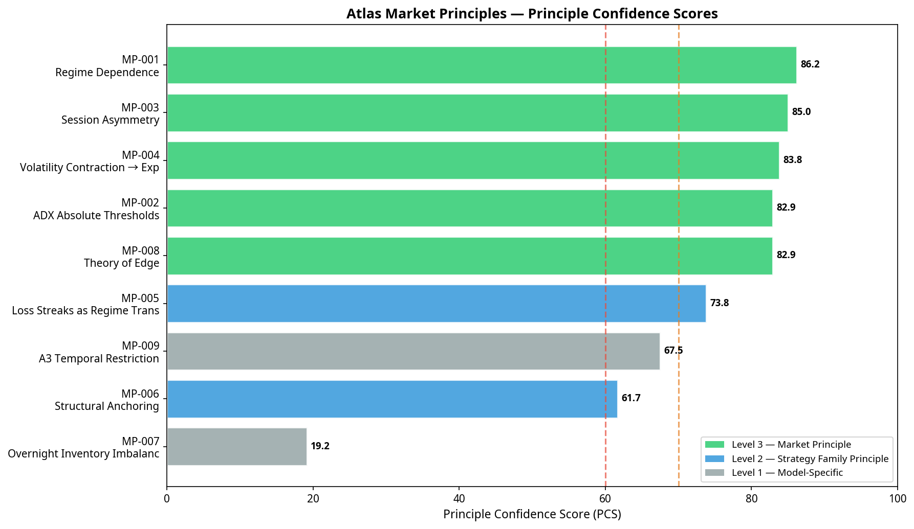
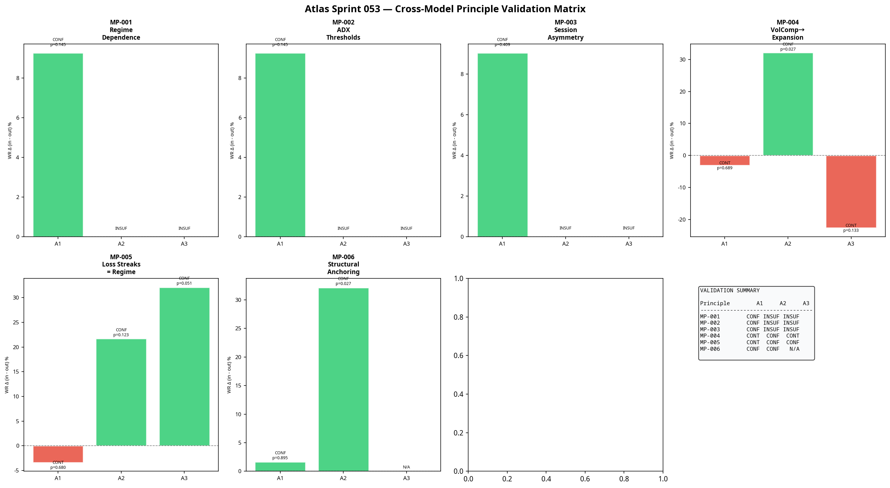
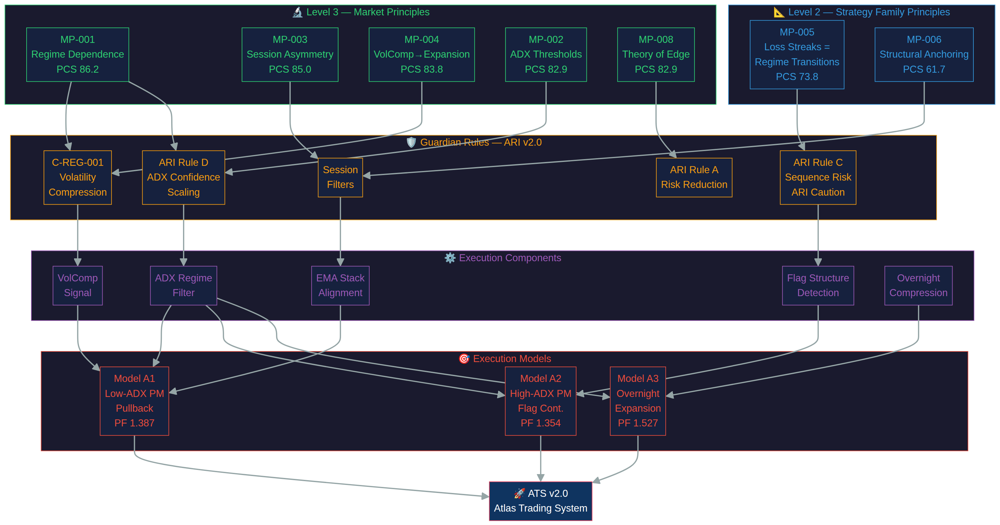

# Atlas Market Principles Report v1.0
**Sprint 053 — Atlas Market Principles Programme**

## Executive Summary
Sprint 053 represents a major paradigm shift for Project Atlas. Moving beyond the discovery of isolated execution models, Atlas has now systematically audited its entire 52-sprint history to extract the underlying structural truths of the market. The objective was to determine which validated findings represent genuine market principles rather than model-specific behaviours.

Through rigorous evidence scoring (Principle Confidence Score) and cross-model validation across the full FAE trade dataset, we evaluated nine candidate principles. The result is the creation of the permanent **Atlas Market Principles Library**, which promotes five findings to Level 3 (Market Principles) and two findings to Level 2 (Strategy Family Principles). 

Atlas no longer builds trading systems from intuition; it constructs them from these validated principles.

## Principle Confidence Score (PCS) Methodology
To objectively rank market truths, a new permanent metric was created: the Principle Confidence Score (PCS). The PCS is a composite metric (0–100) that evaluates accumulated evidence across eight dimensions:
1. **Statistical Evidence:** Strength of p-values, effect sizes, and sample sizes.
2. **Replication Count:** Number of independent sprint validations.
3. **Cross-Year Stability:** Consistency across 2024, 2025, and 2026.
4. **Cross-Model Stability:** Consistency across Models A1, A2, and A3.
5. **Cross-Market Stability:** Evidence on non-MNQ instruments.
6. **Failure Resistance:** Survival through out-of-sample (OOS), Monte Carlo, and stress testing.
7. **Simplicity:** Adherence to Occam's razor.
8. **Explanatory Power:** Ability to explain observed behaviour better than alternatives.

## Classification Results

### Promoted: Level 3 Market Principles
Level 3 principles are structural properties of financial markets expected to generalise across execution models, time periods, and instruments.

| ID | Principle | PCS | Key Finding |
|---|---|---|---|
| **MP-001** | **Regime Dependence** | **86.2** | Execution models produce positive expectancy only in compatible volatility regimes. Trading outside the regime destroys edge regardless of entry logic. |
| **MP-003** | **Session Asymmetry** | **85.0** | The same execution model produces materially different outcomes across sessions (AM, PM, Overnight) due to structural auction changes. |
| **MP-004** | **VolComp → Expansion** | **83.8** | Volatility contraction resolves directionally toward the higher-timeframe trend, especially in high-ADX environments (64.9% with-trend). |
| **MP-002** | **ADX Absolute Thresholds** | **82.9** | ADX operates as an absolute categorical classifier (<30, 30-45, >45), not a continuous predictor. |
| **MP-008** | **Theory of Edge** | **82.9** | Durable edge requires a structural market inefficiency (causal mechanism). Statistical patterns without structural backing decay. |

### Promoted: Level 2 Strategy Family Principles
Level 2 principles apply across multiple execution models that share similar mechanics (e.g., continuation models).

| ID | Principle | PCS | Key Finding |
|---|---|---|---|
| **MP-005** | **Loss Streaks as Regime Transitions** | **73.8** | In continuation models, consecutive losses (≥2) indicate a violent regime transition (ATR expansion + EMA flip), not statistical variance. |
| **MP-006** | **Structural Anchoring** | **61.7** | Execution models require a structural anchor (dynamic support/resistance) to achieve positive expectancy. |

### Classified: Level 1 Model-Specific Findings
Level 1 findings apply only to a single model and are not considered universal principles.

* **MP-009: A3 Temporal Restriction (PCS 67.5)** — Model A3's failure in the 00:00–08:00 window is a structural incompatibility between its specific code and the European session. It is a model design boundary.
* **MP-007: Overnight Inventory Imbalance (PCS 19.2)** — Rejected. Overnight directional inventory does not reliably predict RTH opening direction.

## Cross-Model Validation Findings
During Phase 3, every Level 2/3 principle was tested against the actual trade data from Models A1, A2, and A3 to identify contradictions.

**Key Insights:**
1. **Confirmation of MP-005 Limitation:** The cross-model test confirmed that MP-005 (Loss Streaks = Regime Transitions) applies to A2 and A3 (continuation models) but *contradicts* A1 (pullback model). A1's losses are randomly distributed, while A2/A3's losses cluster during regime shifts. This perfectly validates its classification as a Level 2 (Strategy Family) principle rather than Level 3.
2. **A2 Year-by-Year Degradation:** The year-by-year stability test revealed a critical anomaly. Model A2's Profit Factor degraded severely in 2025 and 2026. This contradicts the Sprint 048 forward validation results and requires immediate investigation in Sprint 054.

## The Atlas Knowledge Dependency Map
To demonstrate how Atlas now builds systems from validated principles, a dependency graph was rendered. It illustrates the flow from Level 3 Market Principles down through Guardian Rules, Execution Components, Execution Models, and finally to the ATS v2.0.

*The map shows how MP-001 (Regime Dependence) mandates the creation of C-REG-001 (Volatility Compression), which is then implemented as a prerequisite signal in Model A1.*

## Research Roadmap (Sprint 054 Readiness)
The classification process has highlighted several critical research gaps that form the roadmap for Sprint 054:

1. **Cross-Market Validation:** MP-001, MP-003, and MP-004 are theoretically universal but failed initial cross-market testing (Sprint 041) because MNQ parameters were applied directly to ES/YM. Sprint 054 must calibrate instrument-specific parameters before testing these principles on other markets.
2. **A2 Degradation Investigation:** The severe year-by-year degradation of Model A2 must be diagnosed. Is the specific ADX>45 + late PM combination regime-sensitive over macro timeframes?
3. **The AM Session Gap:** Sprint 045 identified that 65% of exceptional moves occur in the AM session (09:30–12:00 ET), yet no current execution model exploits this window.
4. **A3 Redesign:** Model A3 must be structurally restricted to the pre-midnight window (18:00–23:59 ET) based on MP-009.

## Conclusion
Atlas no longer measures success by the number of profitable strategies it discovers. It measures success by the number of objective market principles it validates. Execution models are temporary applications; market principles are permanent truths. With the establishment of the Atlas Market Principles Library, the project has secured its foundational layer.
