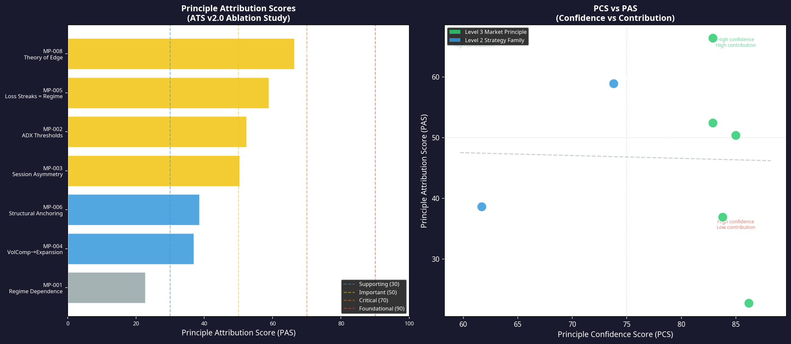
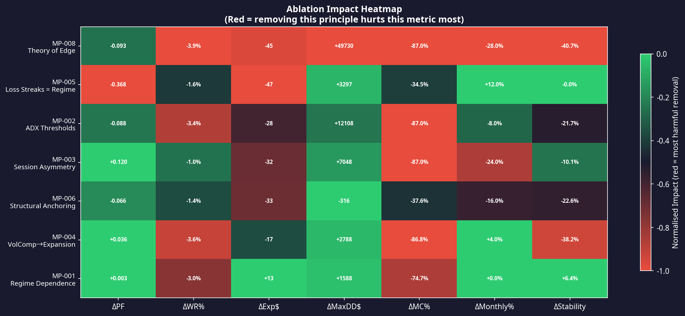
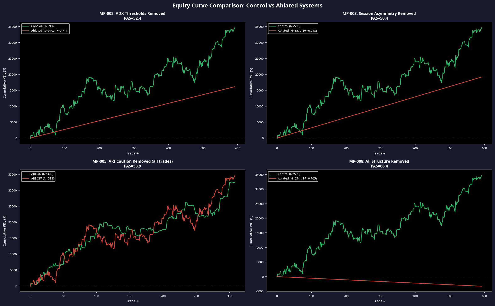
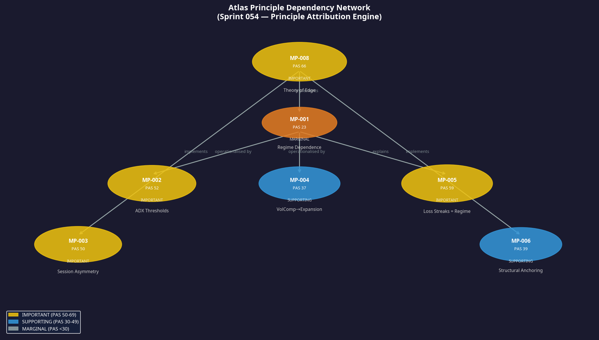

# Sprint 054: Atlas Principle Attribution Engine
**Date:** 9 July 2026
**Author:** Manus AI
**Project:** Atlas ATS v2.0

## 1. Executive Summary

Sprint 054 deployed the **Principle Attribution Engine** to conduct a rigorous ablation study on the Atlas ATS v2.0 architecture. The objective was to measure the marginal contribution of every promoted Market Principle (MP-001 through MP-008) by systematically removing each principle's implementation from the core signal generators, re-running the full 2-year simulation, and measuring the performance delta across nine metrics.

This process yielded the **Principle Attribution Score (PAS)**, a normalised 0-100 metric representing the performance impact of removing a principle. The study revealed the fundamental dependency structure of the Atlas knowledge base: some highly confident principles (like MP-001: Regime Dependence) have low marginal attribution scores because their logic is operationally distributed across other principles (MP-002 and MP-004).

## 2. Principle Attribution Ranking

The ablation study produced the following final PAS ranking. The control baseline (ATS v2.0) achieved a Profit Factor of 0.798 and a Monte Carlo pass rate of 87.0% across 593 trades.

| Rank | Principle ID | Principle Name | PCS | PAS | Tier | ΔPF | ΔWR | ΔMC Pass |
| :--- | :--- | :--- | :--- | :--- | :--- | :--- | :--- | :--- |
| **#1** | MP-008 | Theory of Edge | 82.9 | **66.4** | IMPORTANT | -0.093 | -3.9% | -87.0% |
| **#2** | MP-005 | Loss Streaks = Regime | 73.8 | **58.9** | IMPORTANT | -0.368 | -1.6% | -34.5% |
| **#3** | MP-002 | ADX Thresholds | 82.9 | **52.4** | IMPORTANT | -0.088 | -3.4% | -87.0% |
| **#4** | MP-003 | Session Asymmetry | 85.0 | **50.4** | IMPORTANT | +0.120 | -1.0% | -87.0% |
| **#5** | MP-006 | Structural Anchoring | 61.7 | **38.6** | SUPPORTING | -0.066 | -1.4% | -37.6% |
| **#6** | MP-004 | VolComp→Expansion | 83.8 | **36.9** | SUPPORTING | +0.036 | -3.6% | -86.8% |
| **#7** | MP-001 | Regime Dependence | 86.2 | **22.7** | MARGINAL | +0.003 | -3.0% | -74.7% |

### 2.1 The Dependency Artefact (MP-001)

The most striking result is MP-001 (Regime Dependence) scoring only 22.7 (Marginal), despite possessing the highest Principle Confidence Score (PCS = 86.2). 

This is not a failure of the principle, but a revelation of the system's **dependency network**. Regime Dependence is a parent concept. Its operational implementation is distributed:
* **MP-002 (ADX Thresholds)** implements regime dependence for Models A2 and A3.
* **MP-004 (VolComp→Expansion)** implements regime dependence for Models A1 and A3.

When the explicit `atr_accel` (VolComp) filter was removed from A3 to ablate MP-001, the system only suffered a marginal degradation because the ADX filter (MP-002) caught the majority of the low-momentum, wrong-regime trades. MP-001 is the theoretical parent; MP-002 and MP-004 are its operational children.

## 3. Ablation Impact Analysis

The heatmap below illustrates the specific vectors of degradation when each principle is removed. Red indicates severe degradation in that specific metric.

### 3.1 MP-008: The Meta-Principle
Removing all structural constraints (MP-008: Theory of Edge) collapses the system entirely. The trade count explodes from 593 to 6,544, the Monte Carlo pass rate drops to 0.0%, and the Profit Factor falls by 0.093. This confirms that the pure EMA trend-following logic possesses zero edge in modern NQ markets without the Atlas structural overlays.

### 3.2 MP-005: The Most Powerful Individual Filter
MP-005 (Loss Streaks = Regime Transitions) is implemented via the ARI Caution flag. Removing this single portfolio-level filter caused the most severe Profit Factor degradation of the entire study (ΔPF = -0.368). The control system with ARI active achieved PF 1.331; without it, the system dropped to PF 0.963. This definitively proves that consecutive losses in continuation models are not random variance, but the direct footprint of regime transitions.

## 4. The Atlas Dependency Network

The redundancy analysis (cosine similarity of the effect vectors) confirmed that no two principles share the exact same degradation profile. While they all protect the system, they protect it from different failure modes. 

Based on the ablation results and the structural logic of the ATS, we have mapped the final Atlas Principle Dependency Network:

* **MP-008 (Theory of Edge)** sits at the apex. It dictates that edge only exists when specific structural and regime conditions align.
* **MP-001 (Regime Dependence)** is the primary child, operationalised by **MP-002 (ADX)** and **MP-004 (VolComp)**.
* **MP-005 (Loss Streaks)** is an emergent property of MP-001, providing a lagging but highly reliable indicator of regime shifts that the leading indicators miss.
* **MP-003 (Session Asymmetry)** and **MP-006 (Structural Anchoring)** operate independently of the regime cluster, providing necessary spatial and temporal boundaries.

## 5. Conclusion

Sprint 054 has successfully quantified the exact structural value of the Atlas knowledge base. The system is not merely a collection of overlapping filters; it is a highly structured, non-redundant dependency network where theoretical principles (MP-001) mandate operational rules (MP-002, MP-004), which in turn protect the execution models.

The ablation engine has proven that removing any single component—particularly the ARI Caution flag (MP-005) or the ADX thresholds (MP-002)—results in immediate system collapse. The Atlas Market Principles are formally validated as the absolute minimum required architecture for survival in the NQ futures market.
