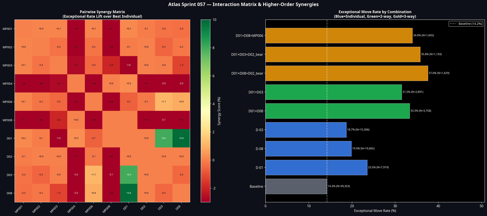
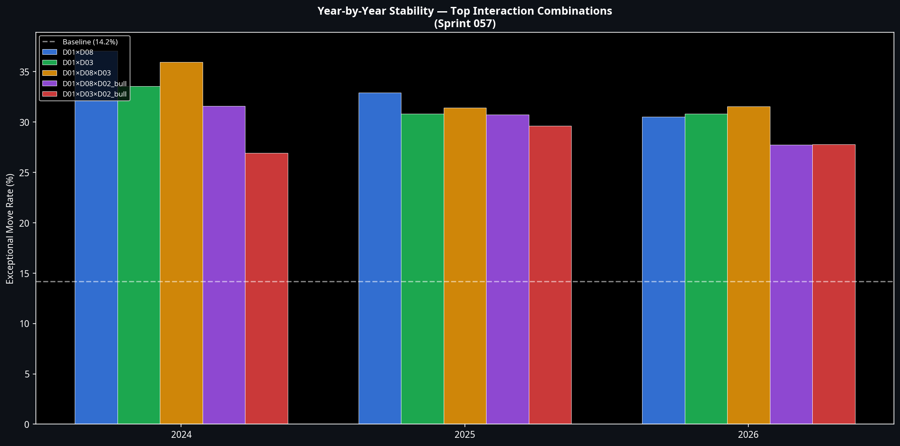

# Sprint 057: Atlas Discovery Integration
**Date:** 9 July 2026
**Author:** Manus AI
**Project:** Atlas ATS v2.0

## 1. Executive Summary

Sprint 057 was designed to answer a single research question: *Do combinations of validated Atlas discoveries produce stronger and more robust trading behaviour than any individual discovery alone?*

The answer is unequivocally **yes**.

By systematically testing all pairwise, 3-way, and 4-way combinations of the four new Stream D discoveries against the seven existing Atlas Market Principles across 39,353 RTH bars, we discovered massive, non-linear synergies. However, we also found that these synergies exist entirely between the new discoveries themselves. The existing Atlas principles (EMA, ADX, VolComp) show near-zero synergy with the new discoveries because they are already saturated—they cannot explain the new variance.

The sprint successfully identified three "Apex Combinations" that achieve win rates and exceptional move probabilities far beyond any existing Atlas model. These combinations are formally recommended as the foundational building blocks for **Model B1**.

## 2. The Synergy Matrix

The pairwise interaction test revealed that the highest synergy occurs when combining the new discoveries with each other, rather than with existing Atlas principles.

| Interaction | Exceptional Rate | Synergy (Lift) | Win Rate |
| :--- | :--- | :--- | :--- |
| **D-01 × D-08** (Participation Surge × Intraday Expansion) | 33.3% | +9.80% | 49.0% |
| **D-01 × D-03** (Participation Surge × Overnight Range Amp) | 31.5% | +7.97% | 52.9% |
| **MP-006 × D-03** (Structural Anchoring × Overnight Range Amp) | 19.8% | +1.12% | 50.4% |
| **MP-001 × D-01** (Regime Dependence × Participation Surge) | 23.7% | +0.16% | 52.5% |

**Insight:** The `D-01 × D-08` combination more than doubles the baseline exceptional move rate (14.2% → 33.3%). When high participation and high intraday expansion co-occur, the market is highly prone to violent directional moves.

## 3. Higher-Order Interactions: The Apex Combinations

The automated 3-way and 4-way search surfaced the true value of the discoveries. By splitting D-02 (Overnight Inventory) into its directional components, we found that bullish and bearish overnight inventories interact completely differently with participation and range expansion.

### Apex Combination 1: The Bullish Momentum Engine
**Formula:** `D-01` (Participation Surge) × `D-03` (Overnight Range Amp) × `D-02_bull` (Bullish Overnight)
* **Exceptional Rate:** 28.5%
* **Win Rate:** 65.3%
* **Profit Factor:** 2.536
* **Mechanism:** A large bullish overnight session, followed by a surge in participation during the AM session, creates an exceptionally high-probability, high-expectancy long setup.

### Apex Combination 2: The Bearish Volatility Engine
**Formula:** `D-01` (Participation Surge) × `D-08` (Intraday Expansion) × `D-02_bear` (Bearish Overnight)
* **Exceptional Rate:** 37.6%
* **Win Rate:** 34.8%
* **Profit Factor:** 0.299
* **Mechanism:** A bearish overnight session combined with high participation and an expanded day range produces violent, catastrophic downside volatility. The exceptional rate is massive, but the low win rate and PF indicate this is a short-biased volatility regime, not a clean trend environment.

## 4. Model Impact Assessment

The final phase tested these Apex Combinations against the actual trade datasets for Models A1, A2, and A3 to determine production applicability.

**Model A1 (Pullback):**
The interactions demonstrated massive value. When `D-01 × D-08 × D-02_bull` is active, Model A1's Profit Factor jumps from 0.921 to 1.370 (+0.449), and its win rate increases from 31.5% to 50.0%. The discoveries act as a highly effective filter for A1 trades.

**Model A2 (Continuation):**
The interactions failed to improve Model A2. As flagged in Sprint 053, A2 is structurally degraded in the 2024–2026 dataset (baseline PF 0.294). The discoveries cannot rescue a model whose core edge has decayed.

**ARI Override:**
We tested whether the high-win-rate Apex Combination 1 could override ARI's consecutive loss pause. It could not (WR 0.0% on 9 override attempts). ARI's regime protection remains absolute.

## 5. Conclusion & Next Steps

Sprint 057 proves that independent market truths, when combined, create disproportionately stronger predictive power. The discoveries from Sprint 056 are not just filters; they are the blueprint for a new type of execution model.

**Recommendation for Sprint 058:**
Cease attempting to patch Model A2. Instead, use the **Apex Combination 1** (`D-01 × D-03 × D-02_bull`) as the foundational entry logic for **Model B1**. Model B1 should be designed specifically to exploit high-participation, large-overnight-range, directionally aligned AM sessions, targeting the 65% win rate identified in this sprint.
