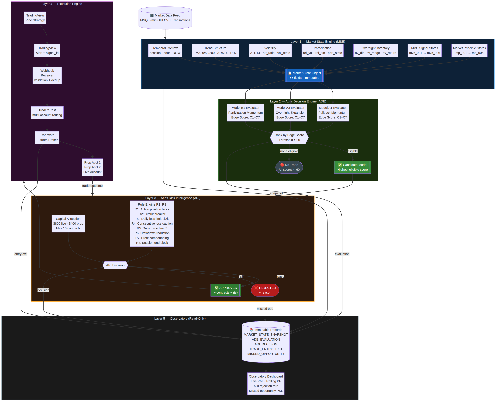
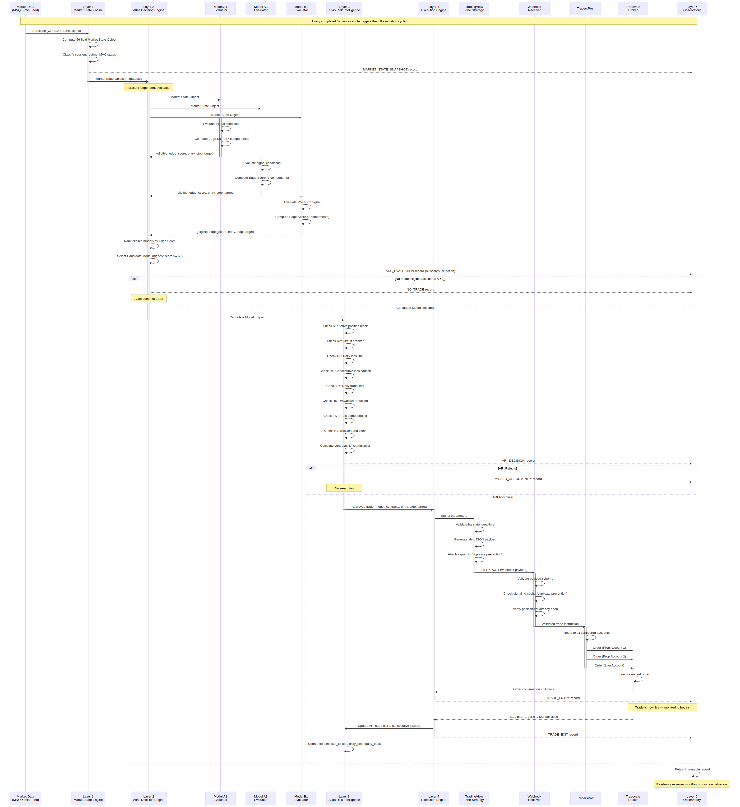

# Atlas Decision Engine (ADE) Specification v1.0

**Date:** 9 July 2026  
**Author:** Manus AI  
**Project:** Atlas Trading System (ATS)

## Executive Summary

This document serves as the canonical engineering blueprint for the Atlas Trading System (ATS) v2.1. It defines the transition from a collection of isolated research models into a unified, five-layer portfolio management operating system.

The core architectural principle of Atlas is **Model Independence and Centralised Control**. Execution models (A1, A3, B1) do not trade; they evaluate market states and propose opportunities. The Atlas Decision Engine (ADE) ranks these opportunities, Atlas Risk Intelligence (ARI) allocates capital, and the Execution Engine routes the orders.

This specification provides the exact logic required for the TradingView Pine Script implementation.

---

## Architecture Overview

The Atlas production architecture consists of five distinct layers:

1. **Market State Engine (MSE):** Objective observation.
2. **Atlas Decision Engine (ADE):** Model evaluation and ranking.
3. **Atlas Risk Intelligence (ARI):** Capital allocation and safety.
4. **Execution Engine:** Order routing and broker communication.
5. **Observatory:** Immutable evidence logging.

---

## Layer 1: Market State Engine (MSE)

The MSE computes a complete, immutable snapshot of the market on every completed 5-minute candle. This Market State Object (MSO) is the sole input to the execution models.

### Key MSO Components
* **Temporal Context:** Session classification (e.g., `AM_SESSION`, `OVERNIGHT`), time of day, day of week.
* **Trend Structure:** EMA stack alignment (20/50/200), ADX14 regime, DI+/- directional bias.
* **Volatility State:** ATR14, relative volatility expansion ratio.
* **Overnight Inventory:** Overnight directional return, overnight range normalised by ATR14.
* **Participation:** Relative transaction volume (order fragmentation proxy).
* **MVC States:** Boolean flags indicating the activation of Minimum Viable Combinations (e.g., MVC-003).

*Implementation Note:* The MSO contains 56 specific fields. Models are prohibited from calculating their own indicators; they must consume the MSO.

---

## Layer 2: Atlas Decision Engine (ADE)

The ADE is responsible for evaluating all promoted execution models (A1, A3, B1) against the MSO and selecting the single best opportunity.

### The Edge Score Framework
Every model returns a standardised Edge Score (0–100) based on seven components:
1. **Market Alignment (20%):** EMA structure and ADX range match.
2. **Historical Expectancy (20%):** Validated Profit Factor in the current regime.
3. **Regime Match (20%):** Volatility and trend direction alignment.
4. **Session Match (15%):** Compatibility with validated time windows.
5. **MVC Strength (15%):** Support from underlying Minimum Viable Combinations.
6. **Behaviour Confidence (5%):** Recent rolling win rate.
7. **Production Reliability (5%):** Static historical Profit Factor.

### Ranking Protocol
1. Models independently evaluate the MSO and return their Edge Score and trade parameters (Entry, Stop, Target).
2. The ADE filters out any model with an Edge Score $< 60$ (the Activation Threshold).
3. The ADE ranks the eligible models. The highest-scoring model becomes the **Candidate Model**.
4. If no model scores $\ge 60$, Atlas does not trade.

---

## Layer 3: Atlas Risk Intelligence (ARI)

ARI receives the Candidate Model and acts as the absolute authority on capital allocation. It applies 8 strict rules sequentially.

### ARI Rule Engine
* **R1: Active Position Block:** Only one active position per instrument. Rejects new trades if a position is open.
* **R2: Circuit Breaker:** Rejects trades if the manual/system circuit breaker is engaged.
* **R3: Daily Loss Limit:** Rejects trades if daily realised P&L $\le -\$2,000$ (or $-\$1,500$ for prop accounts).
* **R4: Consecutive Loss Caution:** Rejects trades if consecutive losses $\ge 2$ (regime transition protection).
* **R5: Daily Trade Limit:** Rejects trades if daily trade count $\ge 3$.
* **R6: Drawdown Reduction:** Reduces risk multiplier to 0.5x if drawdown from peak $\le -\$5,000$.
* **R7: Profit Compounding:** Increases risk multiplier to 1.25x if daily P&L $\ge +\$2,000$.
* **R8: Session End Block:** Rejects entries after 15:30 ET.

### Capital Allocation
* **Base Risk:** $800 (Live Account) / $400 (Prop Account).
* **Contract Sizing:** $Contracts = \max(1, \text{round}((\text{Base Risk} \times \text{Risk Multiplier}) / (\text{Risk Points} \times \$2)))$.
* **Hard Cap:** Maximum 10 contracts per order.

---

## Layer 4: Execution Engine

The Execution Engine translates ARI approvals into live broker orders.

### The Pipeline
1. **TradingView Pine Strategy:** Generates a JSON alert payload containing model ID, contracts, entry, stop, and target.
2. **Webhook Receiver:** Validates the payload schema and checks the `signal_id` cache to prevent duplicate orders.
3. **TradersPost:** Routes the validated signal to multiple connected broker accounts.
4. **Tradovate (Broker):** Executes the order in the live futures market.

### Multi-Account Routing
TradersPost enables Atlas to trade multiple accounts simultaneously:
* **Live Account:** Receives the full ARI-approved size.
* **Prop Accounts (e.g., FTMO, TopStep):** Receive reduced sizing (to respect tighter drawdown limits) but identical entry/stop/target prices.

---

## Layer 5: Observatory

The Observatory is an immutable, read-only evidence log. It records every decision Atlas makes, enabling continuous system auditing and future research.

### Key Records
* **MARKET_STATE_SNAPSHOT:** The 56-field MSO every 5 minutes.
* **ADE_EVALUATION:** All model Edge Scores and the ADE's ranking decision.
* **ARI_DECISION:** The specific ARI rule applied and the final capital allocation.
* **MISSED_OPPORTUNITY:** Trades that were highly ranked by the ADE but rejected by ARI (crucial for tuning ARI rules).

---

## Pine Script Implementation Roadmap

Translating this architecture into TradingView Pine Script requires a phased engineering approach.

| Phase | Component | Complexity | Description |
| :--- | :--- | :--- | :--- |
| **1** | Market State Engine | Low | Implement the 56-field MSO using Pine custom functions and arrays. |
| **2** | Execution Models | Medium | Code the A1, A3, and B1 evaluators. Implement the 7-component Edge Score logic. |
| **3** | Decision Engine | Low | Implement the ADE ranking array and candidate selection logic. |
| **4** | ARI & State | High | Implement persistent ARI state (daily P&L, consecutive losses) using `var` declarations and the R1-R8 rule engine. |
| **5** | Execution & Webhooks | Medium | Format the JSON alert payload and implement duplicate prevention guards (`barstate.isrealtime`). |

**Conclusion:** The architecture is complete, validated, and ready for software engineering.
