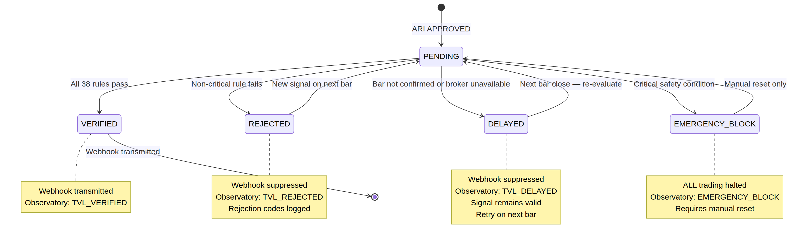
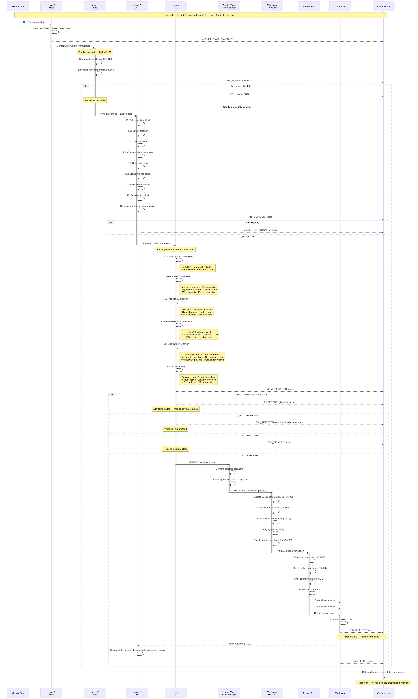

# Atlas Trade Verification Layer (TVL) Specification v1.0

**Date:** 9 July 2026  
**Author:** Manus AI  
**Project:** Atlas Trading System (ATS)

## Executive Summary

This document specifies the **Trade Verification Layer (TVL)** for Atlas ATS v2.1. The TVL is the final production gatekeeper. Its sole purpose is to independently verify that every trade approved by the Atlas Decision Engine (ADE) and Atlas Risk Intelligence (ARI) exactly matches the production specification before capital is placed at risk.

The guiding principle of the TVL is absolute conservatism: **If uncertainty exists, Atlas does not trade. A missed trade is acceptable; an unintended trade is unacceptable.**

This document provides the complete validation pipeline, the state machine, and the Pine Script Safety Roadmap to guide the software implementation.

---

## TVL Architecture & State Machine

The TVL evaluates every approved trade against 38 specific rules across 6 validation categories. 



### Output States
The TVL always resolves to one of four states:
1. **VERIFIED:** All 38 rules pass. The webhook is transmitted.
2. **REJECTED:** A non-critical rule fails. The webhook is suppressed, and the rejection is logged in the Observatory.
3. **DELAYED:** A transient issue exists (e.g., waiting for bar close confirmation). The signal remains valid and is re-evaluated on the next bar.
4. **EMERGENCY BLOCK:** A critical safety condition is detected (e.g., duplicate position, broker disconnect). All trading is halted until manual review.

---

## Validation Pipeline

The TVL enforces 6 categories of independent verification.

### Category 1: Execution Model Verification
Ensures the signal originated from a promoted, eligible model selected by the ADE.
* **C1-01:** Valid Model ID (A1, A3, B1).
* **C1-02:** Model is currently promoted.
* **C1-03:** Model was eligible in the current market state.
* **C1-04:** Model ID matches the ADE-selected candidate.
* **C1-05:** Edge Score $\ge 60$.

### Category 2: Market State Verification
Ensures the market has not materially changed since the ADE evaluation.
* **C2-01:** `barstate.isrealtime == true` (The most critical Pine guard against historical replay execution).
* **C2-02:** Session is still valid.
* **C2-03:** Regime (ADX) is unchanged.
* **C2-04:** Trading window is open (before 15:30 ET).
* **C2-05:** Market State Object timestamp matches current bar.
* **C2-06:** Entry price is within 0.5% of current close.

### Category 3: ARI Re-Verification
An independent check of the ARI state at the exact moment of transmission.
* **C3-01:** Daily loss limit not breached.
* **C3-02:** Consecutive loss count $< 2$.
* **C3-03:** Circuit breaker inactive (Failure = EMERGENCY BLOCK).
* **C3-04:** Daily trade count $< 3$.
* **C3-05:** No active position exists (Failure = EMERGENCY BLOCK).
* **C3-06:** Risk multiplier is sane ($0.25 \le \text{multiplier} \le 2.0$).

### Category 4: Trade Parameter Verification
Mathematical validation of the order geometry.
* **C4-01:** Entry price valid ($>0$).
* **C4-02:** Stop price valid and on correct side of entry.
* **C4-03:** Target price valid and on correct side of entry.
* **C4-04:** Risk points consistent with Entry - Stop.
* **C4-05:** Contract quantity valid ($1 \le \text{contracts} \le 10$).
* **C4-06:** Risk dollars consistent with contracts and points.
* **C4-07:** R-Multiple $\ge 1.5$.
* **C4-08:** Direction is LONG or SHORT.
* **C4-09:** Stop distance $\ge 0.5 \times \text{ATR14}$.

### Category 5: Duplicate Prevention
Infrastructure-level checks to prevent duplicate executions.
* **C5-01:** Unique `signal_id` (60-second rolling cache).
* **C5-02:** Current bar has not already been traded.
* **C5-03:** No pending webhook in flight.
* **C5-04:** No pending unacknowledged order at broker.
* **C5-05:** Duplicate JSON payload hash check.
* **C5-06:** Position reconciliation (Pine state matches Broker state).

### Category 6: Broker Safety
Final infrastructure checks before routing.
* **C6-01:** Broker trading session is OPEN.
* **C6-02:** Ticker symbol matches.
* **C6-03:** TradersPost account is ACTIVE.
* **C6-04:** Tradovate connection is ACTIVE.
* **C6-05:** Webhook payload fields are valid.
* **C6-06:** JSON validates against schema.

---

## End-to-End Production Flow v2.2

The TVL sits exactly between the ARI capital allocation and the TradingView alert transmission.



---

## Pine Script Safety Roadmap

To implement the TVL securely, responsibilities must be distributed across the infrastructure stack based on the capabilities of each layer.

| Validation Layer | Scope | Rules Enforced | Capabilities |
| :--- | :--- | :--- | :--- |
| **TradingView Pine Script** | **27 Rules** (C1, C2, C3, C4, C5-02) | Enforces all logical, mathematical, and state-based rules. | Full access to OHLCV, indicator arrays, and strategy state. Uses `barstate.isrealtime` to prevent historical alerts. |
| **Webhook Receiver** | **6 Rules** (C5-01, C5-03, C5-05, C6-02, C6-05, C6-06) | Enforces payload integrity, schema validation, and immediate deduplication. | Maintains `signal_id` and payload hash caches. Parses JSON. |
| **TradersPost** | **4 Rules** (C5-04, C6-01, C6-03, C6-04) | Enforces broker connectivity and account safety. | Access to live Tradovate connection state and account status. |
| **External Atlas Service** | **1 Rule** (C5-06) | Enforces position reconciliation. | Can query both TradingView (via REST) and Tradovate to ensure state synchronisation. |

### The Critical Pine Script Guard
The most important rule in the entire system is **C2-01**. In Pine Script, alerts can fire during historical recalculations if not explicitly guarded. Every webhook transmission block MUST be wrapped in:

```pine
if barstate.isrealtime and barstate.isconfirmed
    // TVL verification and webhook transmission
```

## Conclusion
The Trade Verification Layer ensures that Atlas fails safely. By requiring 38 independent verifications across four infrastructure layers before a single order is routed, the TVL protects the portfolio from logic errors, duplicate signals, and broker desynchronisation. 

Atlas ATS v2.1 is now fully specified and ready for code implementation.
